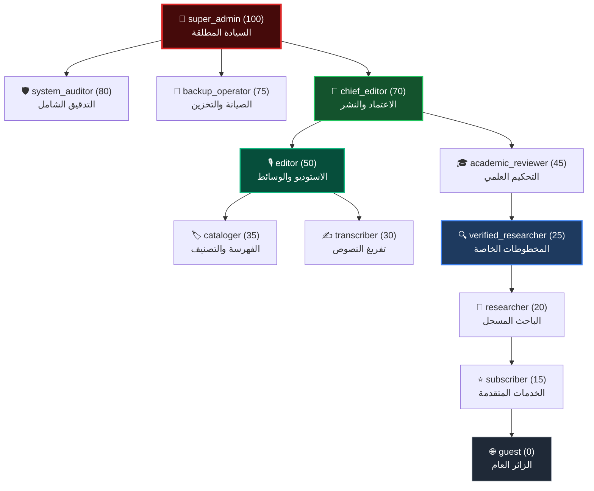
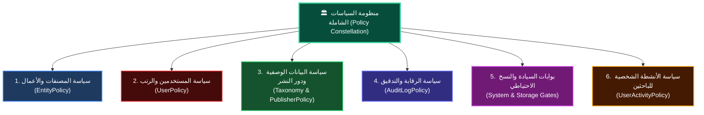
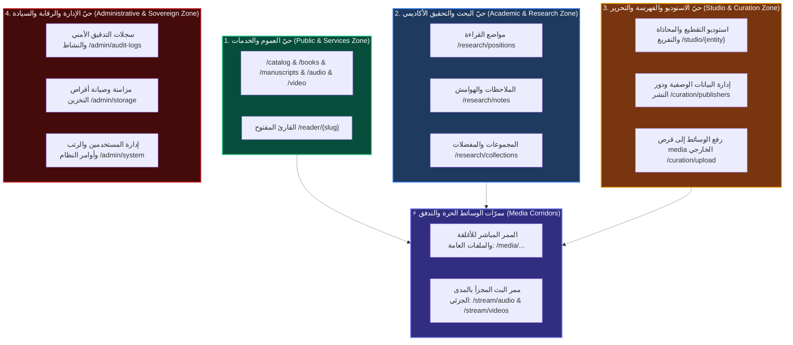
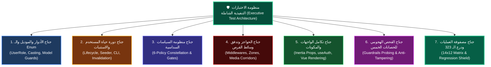

# 🏛️ الدليل المعماري والتنفيذي الشامل لمنظومة الهوية والصلاحيات (Auth & RBAC Blueprint)
## منصة الأرشيف الرقمي الموحد — Entity Digital Library

---

> **الهدف من هذا الدليل:**  
> تقديم وثيقة مرجعية استراتيجية وهندسية متكاملة لضبط منظومة الهوية، الصلاحيات، ومستويات الوصول (Authentication & Authorization) في منصة الأرشيف الرقمي، بالاعتماد على الهيكل السداسي الحاكم والكلمات التوسعية الثلاثين، وإدراج كامل **الأدوار الـ 12** بكافة تفاصيلها ليكون مرشداً معمارياً دقيقاً عند التنفيذ البرمجي.

---

## 🧭 البوصلة الهندسية: الأركان الستة مرتبة منطقياً


---

## 💎 مصفوفة الأركان الستة والكلمات التوسعية الثلاثين

| # | الركن الأساسي | كلمات التوسعة الخمس التابعة له | الوظيفة الهندسية للركن |
|---|---|---|---|
| **1** | **أدوار (Roles)** | **مسمياتٌ، فهرمية، فمصفوفةٌ، فتعداد، فحصانة** | التجريد النظري لرتب ومسؤوليات النظام وصياغتها البرمجية. |
| **2** | **مستخدمون (Users)** | **هويّةٌ، فحالة، فاستنباتٌ، فتتبّع، فارتباط** | تجسيد الهوية في قاعدة البيانات والربط بدورات الحياة والأنشطة. |
| **3** | **سياسات (Policies)** | **تشريعٌ، فتجريد، فتدقيقٌ، فردع، وتجاوُز** | العقل التشريعي والأمني في الباك إند الحاكم للعمليات والموديلات. |
| **4** | **مناطق (Zones)** | **ترسيمٌ، فحواجز، فتوجيهٌ، فعزل، وممرّات** | الترسيم الجغرافي للمسارات (Routes & Middlewares) وحماية المداخل. |
| **5** | **واجهات (Interfaces)** | **حقنٌ، فتكيّف، فملاحةٌ، فتغذية، وسلاسة** | التكيف البصري التلقائي لشاشات Vue 3 وحجب/إظهار الأدوات بذكاء. |
| **6** | **اختبارات (Tests)** | **شمولٌ، فتقمّص، فاختراقٌ، فمناعة، واعتماد** | شبكة الأمان الآلية للتأكد من انعدام الثغرات وسلامة الكود بنسبة 100%. |

---

## 🔍 التفصيل التشريحي للأركان الستة (The 6 Pillars Deep Dive)

```
================================================================================
الركن الأول: «أدوار» (Roles) — الهيكل الشامل للأدوار الـ 12
================================================================================
```

### 1. مسميات (Personas):
تم توزيع الـ 12 دوراً على **4 قطاعات تشغيلية**:

* **أولاً: القطاع الإداري والتقني (Administrative & Technical):**
  1. `super_admin` **(مدير النظام الشامل والجذري):** السيادة التقنية المطلقة، إدارة الخوادم، تصفير وتهجير البيانات، وإدارة الحسابات والرتب.
  2. `system_auditor` **(مدقق ومراقب النظام):** جهة رقابية لمتابعة سجلات النشاط والأمان ومحاولات التسلل، بقراءة غير قابلة للتعديل.
  3. `backup_operator` **(مشغل النسخ الاحتياطي والصيانة):** إدارة الأرشفة، فحص سلامة الروابط، ومزامنة وسائط التخزين الخارجي على قرص `media`.

* **ثانياً: قطاع الاستوديو والتحرير والفهرسة (Studio & Curation):**
  4. `chief_editor` **(رئيس التحرير والاعتماد):** المعتمد النهائي لنشر الكتب والمخطوطات للجمهور بعد استيفاء الفهرسة والمراجعة.
  5. `editor` **(محرر الاستوديو والوسائط):** تقطيع المقاطع الصوتية والمرئية، محاذاة اللوحات، وتوليد شجرة العقد النصية (`ContentNodes`).
  6. `cataloger` **(مفهرس البيانات الوصفية):** ضبط بيانات المؤلفين، المحققين، دور النشر، أرقام الإيداع، والتصنيفات الموضوعية.
  7. `transcriber` **(ناسخ ومفرّغ النصوص):** تفريغ وتصحيح النصوص المقابلة لصفحات المخطوطات والوسائط داخل الاستوديو بدقة كلمة بكلمة.

* **ثالثاً: القطاع الأكاديمي والبحثي (Academic & Research):**
  8. `academic_reviewer` **(مُحكّم ومراجع علمي):** التحقيق التخصصي للنسخ الخطية وضبط الروايات وكتابة التقارير النقدية.
  9. `verified_researcher` **(باحث موثّق ومتقدم):** وصول حصري للمخطوطات النادرة والمسودات قيد التحقيق مع ميزات تصدير عالية الدقة.
  10. `researcher` **(باحث ومستفيد مسجل):** حفظ مواضع القراءة التلقائية (`reading_positions`)، الهوامش، والعلامات المرجعية والمجموعات.

* **رابعاً: قطاع الخدمة والعموم (Public & Services):**
  11. `subscriber` **(مشترك خدمات مخصصة):** ميزات إضافية للمستفيدين كالتنزيل المجمع السريع وأولويات البث.
  12. `guest` **(الزائر العام):** تصفح الأرشيف المفتوح، قراءة الكتب المتاحة، واستماع ومشاهدة الوسائط الحرة دون تسجيل دخول.

---

### 2. هرمية (Hierarchy):
ترتيب هرمي وزني تصاعدي (Weight من 0 إلى 100) يحكم وراثة الصلاحيات الأساسية:



---

### 3. مصفوفة (Matrix):
ربط دقيق وشامل لكافة الأدوار بالعمليات التشغيلية (انظر جدول المصفوفة التفصيلية أدناه).

---

### 4. تعداد (Enum):
كود صلب عبر PHP 8.4 Backed Enum: `App\Enums\UserRole` يضبط كافة الأدوار، أوزانها، ألوانها، وتوابع التحقق:

```php
<?php

namespace App\Enums;

enum UserRole: string
{
    // 1. القطاع الإداري والتقني
    case SUPER_ADMIN = 'super_admin';
    case SYSTEM_AUDITOR = 'system_auditor';
    case BACKUP_OPERATOR = 'backup_operator';

    // 2. قطاع الاستوديو والتحرير والفهرسة
    case CHIEF_EDITOR = 'chief_editor';
    case EDITOR = 'editor';
    case CATALOGER = 'cataloger';
    case TRANSCRIBER = 'transcriber';

    // 3. القطاع الأكاديمي والبحثي
    case ACADEMIC_REVIEWER = 'academic_reviewer';
    case VERIFIED_RESEARCHER = 'verified_researcher';
    case RESEARCHER = 'researcher';

    // 4. قطاع الخدمة والعموم
    case SUBSCRIBER = 'subscriber';
    case GUEST = 'guest';

    public function label(): string
    {
        return match ($this) {
            self::SUPER_ADMIN => 'مدير النظام الشامل',
            self::SYSTEM_AUDITOR => 'مدقق ومراقب النظام',
            self::BACKUP_OPERATOR => 'مشغل النسخ الاحتياطي والتخزين',
            self::CHIEF_EDITOR => 'رئيس التحرير والاعتماد',
            self::EDITOR => 'محرر الاستوديو والوسائط',
            self::CATALOGER => 'مفهرس البيانات الوصفية',
            self::TRANSCRIBER => 'ناسخ ومفرّغ النصوص',
            self::ACADEMIC_REVIEWER => 'مُحكّم ومراجع علمي',
            self::VERIFIED_RESEARCHER => 'باحث أكاديمي موثّق',
            self::RESEARCHER => 'باحث مسجل',
            self::SUBSCRIBER => 'مشترك خدمات',
            self::GUEST => 'زائر عام',
        };
    }

    public function weight(): int
    {
        return match ($this) {
            self::SUPER_ADMIN => 100,
            self::SYSTEM_AUDITOR => 80,
            self::BACKUP_OPERATOR => 75,
            self::CHIEF_EDITOR => 70,
            self::EDITOR => 50,
            self::ACADEMIC_REVIEWER => 45,
            self::CATALOGER => 35,
            self::TRANSCRIBER => 30,
            self::VERIFIED_RESEARCHER => 25,
            self::RESEARCHER => 20,
            self::SUBSCRIBER => 15,
            self::GUEST => 0,
        };
    }

    public function sector(): string
    {
        return match ($this) {
            self::SUPER_ADMIN, self::SYSTEM_AUDITOR, self::BACKUP_OPERATOR => 'القطاع الإداري والتقني',
            self::CHIEF_EDITOR, self::EDITOR, self::CATALOGER, self::TRANSCRIBER => 'قطاع الاستوديو والتحرير',
            self::ACADEMIC_REVIEWER, self::VERIFIED_RESEARCHER, self::RESEARCHER => 'القطاع الأكاديمي والبحثي',
            self::SUBSCRIBER, self::GUEST => 'قطاع الزوار والخدمات',
        };
    }

    public function badgeColor(): string
    {
        return match ($this) {
            self::SUPER_ADMIN => 'bg-red-500/10 text-red-500 border-red-500/20',
            self::SYSTEM_AUDITOR => 'bg-indigo-500/10 text-indigo-400 border-indigo-500/20',
            self::BACKUP_OPERATOR => 'bg-cyan-500/10 text-cyan-400 border-cyan-500/20',
            self::CHIEF_EDITOR => 'bg-emerald-500/10 text-emerald-400 border-emerald-500/20',
            self::EDITOR => 'bg-teal-500/10 text-teal-400 border-teal-500/20',
            self::CATALOGER => 'bg-amber-500/10 text-amber-400 border-amber-500/20',
            self::TRANSCRIBER => 'bg-orange-500/10 text-orange-400 border-orange-500/20',
            self::ACADEMIC_REVIEWER => 'bg-purple-500/10 text-purple-400 border-purple-500/20',
            self::VERIFIED_RESEARCHER => 'bg-blue-500/10 text-blue-400 border-blue-500/20',
            self::RESEARCHER => 'bg-sky-500/10 text-sky-400 border-sky-500/20',
            self::SUBSCRIBER => 'bg-violet-500/10 text-violet-400 border-violet-500/20',
            self::GUEST => 'bg-zinc-500/10 text-zinc-400 border-zinc-500/20',
        };
    }

    public function canAccessStudio(): bool
    {
        return in_array($this, [self::SUPER_ADMIN, self::CHIEF_EDITOR, self::EDITOR, self::TRANSCRIBER], true);
    }

    public function canCurateMetadata(): bool
    {
        return in_array($this, [self::SUPER_ADMIN, self::CHIEF_EDITOR, self::EDITOR, self::CATALOGER], true);
    }

    public function canPublish(): bool
    {
        return in_array($this, [self::SUPER_ADMIN, self::CHIEF_EDITOR], true);
    }

    public function isAtLeast(UserRole $role): bool
    {
        return $this->weight() >= $role->weight();
    }
}
```

---

### 5. حصانة (Guardrails):
* **الحصانة 1 (منع الترقية الذاتية):** منع أي مستخدم من تعديل رتبته بنفسه، ومنع أي إداري من منح رتبة تساوي رتبته أو تفوقها.
* **الحصانة 2 (حصانة المدير الأخير):** منع حذف أو تجميد (`is_active = false`) أو تخفيض رتبة آخر `super_admin` في المنظومة.
* **الحصانة 3 (درع التعيين الكتلي):** استبعاد `role` و `is_active` من `$fillable` وعدم التعديل إلا عبر توابع صريحة وموثقة في سجل التدقيق.
* **الحصانة 4 (الفصل الرقابي):** حرمان `system_auditor` من صلاحيات الكتابة لمنع تزوير سجلات التدقيق.
* **الحصانة 5 (حصانة التخزين الخارجي):** منع حذف أي ملف مادي من قرص `/mnt/Data-ex/EX-temp/Media` إلا بتوقيع صريح ومؤكد من `super_admin`.

---

```
================================================================================
الركن الثاني: «مستخدمون» (Users)
================================================================================
```
1. **هويّة (Identity):**
   - حقل `role` مفهرس (Indexed) مربوط بالـ Enum `UserRole`.
   - **قاعدة التسجيل الذاتي:** التسجيل المفتوح عبر الواجهة يمنح المستخدم رتبة `researcher` (باحث مسجل) تلقائياً، في حين تقتصر باقي الرتب الـ 11 التخصصية على التعيين اليدوي الصريح من قبل `super_admin`.
2. **حالة (State):**
   - اعتماد حقل `is_active (Boolean)` لحظر أو تجميد أي حساب فورياً دون حذف بياناته وتاريخه.
   - **إبطال الجلسات الحية (Session Invalidation):** بمجرد ضبط `is_active = false`، يقوم الميدلوير بطرد جلسة المستخدم ومصادرتها فوراً.
3. **استنبات (Provisioning):**
   - بيئة التطوير: `UserSeeder` لتوليد حسابات نموذجية للأدوار الـ 12 بكلمات مرور افتراضية.
   - بيئة الإنتاج: أمر طرفية تفاعلي آمن `php artisan user:create-admin` لإنشاء المدير الجذري الأول دون كشف كلمات المرور في مستودع Git.
4. **تتبّع (Tracking):**
   - حفظ مواضع القراءة (`reading_positions`) وآخر موضع في الاستوديو في جداول مخصصة مستقلة لضمان بقاء جدول `users` خفيفاً وفائق السرعة في استعلامات المصادقة اليومية.
5. **ارتباط (Relations):**
   - توثيق علاقات المستخدم بسجل العمليات (`Activity`) والملاحظات الشخصية (`UserNotes`) والمجموعات البحثية (`Collections`).

---

```
================================================================================
الركن الثالث: «سياسات» (Policies) — منظومة السياسات السداسية الشاملة
================================================================================
```

### 1. تجريد (Polymorphic Abstraction):
بدلاً من تشتيت الكود وتكرار الشروط عبر سياسات متعددة لكل نوع وعاء، تعتمد المنظومة على **منظومة متكاملة من 6 سياسات وبوابات مركزية**:



### 2. تفصيل السياسات الست ومواطن الأدوار فيها:
1. **`EntityPolicy` (المصنفات والاستوديو والوسائط):**
   - تحكم كافة الكيانات (كتب، مخطوطات، تسجيلات صوتية، مرئيات، وعقد نصية).
   - `view`: عام للمنشور، ومقيد للمسودات والمخطوطات النادرة للباحثين الموثقين (`verified_researcher` فأعلى).
   - `accessStudio`: مخصص للمحررين والنساخين (`transcriber`, `editor`, `chief_editor`).
   - `publish` و `delete`: محصورة برئيس التحرير (`chief_editor`).
   - `forceDelete`: محصورة بالإدارة العليا (`super_admin`).

2. **`UserPolicy` (المستخدمون والرتب والتجميد):**
   - `viewAny`: لمدقق النظام `system_auditor` والمدير العام `super_admin`.
   - `changeRole`: لـ `super_admin` فقط مع تطبيق حظر الترقية الذاتية وحظر منح رتبة تعادل أو تفوق رتبة المنفذ.
   - `deactivate`: يمنع منعاً باتاً تجميد آخر مدير عام نشط في المنظومة.

3. **`PublisherPolicy` / `TaxonomyPolicy` (دور النشر والفهارس والتصنيفات):**
   - `viewAny / view`: مفتوحة للجمهور والزوار.
   - `create / update`: لفريق الفهرسة والتحرير (`cataloger`, `editor`, `chief_editor`).
   - `delete`: لرئيس التحرير والمدير العام وبشرط ألا تكون الدار أو التصنيف مرتبطة بمصنفات نشطة.

4. **`AuditLogPolicy` (سجلات التدقيق والأمان الرقمي):**
   - `viewAny / view`: لـ `system_auditor` و `super_admin`.
   - `update / delete`: **ممنوعة منعاً قاطعاً ومطلقاً (False للجميع حتى للمدير العام)** للحفاظ على ثبات ونزاهة السجلات الرقمية (Immutability).

5. **`System & Storage Gates` (بوابات السيادة والنسخ الاحتياطي):**
   - `manage-backups`: مخصصة لمشغل النسخ الاحتياطي `backup_operator` والمدير العام لإدارة وسائط القرص الخارجي.
   - `run-system-commands`: مقصورة على `super_admin` حصراً لتشغيل أوامر الصيانة وتصفير البيانات.
   - `bulk-import-excel`: لـ `chief_editor` و `super_admin` لمهام استيراد البيانات الضخمة.

6. **`UserActivityPolicy` (خصوصية الباحثين):**
   - تحكم الملاحظات الشخصية والعلامات ومواضع القراءة.
   - تخضع لمبدأ الملكية الخاصة الصارمة (`$user->id === $record->user_id`) لحماية خصوصية الباحثين.

---

### 3. تدقيق (Gate Enforcement) — خط الدفاع الثلاثي:
- **المستوى الأول:** حراس المسارات (Route Middlewares) للفرز العام.
- **المستوى الثاني:** تدقيق الكنترولر عبر `Gate::authorize(...)` عند مدخل كل دالة لحماية العمليات الفردية.
- **المستوى الثالث:** التكيف البصري في قوالب Vue لإخفاء الأدوات غير المصرح بها مسبقاً.

---

### 4. ردع (Informative Denial) — الردع التفسيري:
- استخدام `Response::deny('رسالة عربية شارحة...')` لإعلام المستخدم بوضوح بسبب الرفض بدلاً من أخطاء الـ 403 الصامتة.

---

### 5. تجاوُز (Super-Admin Bypass):
- تفعيل العبور التلقائي المركزي للمدير العام عبر `Gate::before` في مزود الخدمة:
```php
Gate::before(fn (User $user, string $ability) => $user->isSuperAdmin() ? true : null);
```

---

```
================================================================================
الركن الرابع: «مناطق» (Zones) — الترسيم الجغرافي وحراسة المسارات
================================================================================
```

> [!NOTE]
> **تنبيه منهجي للمراجعة:**  
> تم تثبيت هذا الركن بهيكله المعماري المتناظر مع قطاعات الأدوار وممرات الوسائط، وهو **خاضع للمزيد من المراجعة والتدقيق والنقاش** لإحكام تفاصيله التشغيلية قبل الاعتماد النهائي لكود المسارات في مرحلة التطبيق.

---

### 1. ترسيم (Demarcation) — الأحياز الجغرافية الأربعة وممرّات الوسائط:
إسقاط قطاعات الأدوار الأربعة هندسياً على مسارات المنصة في 4 أحياز متمايزة وممر وسائط متخصص:



#### بطاقة تعريف الأحياز الأربعة:
1. **حيّ العموم والخدمات (Public & Services Zone):**
   - **المستفيدون:** الزائر العام (`guest`) والمشترك (`subscriber`).
   - **طبيعة العمل:** قراءة عامة، تصفح الفهارس، الاستماع والمشاهدة الحرة، والبحث المفتوح بلا اشتراط تسجيل دخول.
2. **حيّ البحث والتحقيق (Academic & Research Zone):**
   - **المستفيدون:** الباحث المسجل (`researcher`)، الباحث الموثق (`verified_researcher`)، والمحكم العلمي (`academic_reviewer`).
   - **طبيعة العمل:** حفظ مواضع القراءة التلقائية، الهوامش والتحقيقات، تقارير الفروق الخطية، والمجموعات الخاصة.
3. **حيّ الاستوديو والفهرسة (Studio & Curation Zone):**
   - **المستفيدون:** الناسخ (`transcriber`)، المفهرس (`cataloger`)، المحرر (`editor`)، ورئيس التحرير (`chief_editor`).
   - **طبيعة العمل:** تقطيع ومحاذاة لوحات المخطوطات، مزامنة الصوت مع النصوص، إدخال بطاقات دور النشر والمؤلفين، ورفع الوسائط لقرص `media`.
4. **حيّ الإدارة والسيادة (Administrative & Sovereign Zone):**
   - **المستفيدون:** مشغل النسخ الاحتياطي (`backup_operator`)، مدقق النظام (`system_auditor`)، والمدير العام (`super_admin`).
   - **طبيعة العمل:** مراقبة سجلات الأمان، مزامنة التخزين الخارجي، إدارة المستخدمين، وتنفيذ أوامر الخادم وقواعد البيانات.

---

### 2. فحواجز (Middlewares) — ترسانة الحراسة متعددة المستويات:
* **حارس التحقق من النشاط (`EnsureUserIsActive`):** طرد الحسابات المجمدة وإبطال جلستها فوراً.
* **حارس الرتب (`EnsureUserHasRole`):** فحص الرتبة القطاعية أو الهرمية قبل ملامسة أي كنترولر.

```
┌────────────────────────────────────────────────────────────────────────┐
│                     ترتيب عبور الطلب عبر الحواجز                       │
├────────────────────────────────────────────────────────────────────────┤
│ الطلب ──► [auth] ──► [EnsureUserIsActive] ──► [EnsureUserHasRole] ──► Controller
└────────────────────────────────────────────────────────────────────────┘
```

---

### 3. فتوجيهٌ (Redirection) — محرك التوجيه الذكي والردع:
* **التوجيه السياقي بعد تسجيل الدخول (Context-Aware Redirection):**
  - حفظ وجهة المستخدم الأصلية والعودة إليها (`redirect()->intended()`).
  - توجيه المستخدم وفق رتبته: المدير العام لأوامر النظام، المدقق لسجلات الأمان، المشغل لإدارة الأقراص، طاقم الاستوديو للورشة، والباحثون لمواضع قراءتهم.
* **التوجيه الرادع (Informative 403 Redirection):**
  - تحويل المتسللين إلى صفحة `403` تشرح بوضوح سبب الرفض والرتبة الدنيا المطلوبة.

---

### 4. فعزل (Isolation) — عزل البروتوكولات والمهام الحساسة:
* **عزل استوديو العمليات اللحظية (Studio Auto-Save Isolation):**
  - مسارات حفظ العقد النصية والتجزئة اللحظية (`/studio/{entity}/nodes`) مفصولة كمسارات بروتوكولية خفيفة ترجع استجابات JSON نقية دون استدعاء صفحات Inertia لمنع أي إعادة تحميل غير مقصودة.
* **عزل سجلات الرقابة (Audit Read-Only Isolation):**
  - مسارات سجلات التدقيق `/admin/audit-logs` معزولة في مسارات قراءة فقط (`GET`) خالية تماماً من مسارات التعديل أو الحذف.
* **عزل العمليات التدميرية (Destructive Actions Isolation):**
  - أوامر الخادم والتصفير محصورة بطلبات `POST` ومحمية بتأكيد كلمة المرور (`password.confirm`).

---

### 5. وممرّات (Media Corridors) — ممرات شريان التخزين:
* **ممر الأصول العامة المباشر (`/media/...`):** لخدمة الأغلفة والشعارات والملفات المفتوحة عبر Symlinks المباشرة وبسرعة عالية.
* **ممر البث التفاعلي المجزأ (`/stream/...`):** لدفق الصوتيات والمرئيات مع دعم ترويسات `HTTP 206 Partial Content` لتمكين التقديم والتأخير اللحظي في قارئ الكتب ومشغلات الاستوديو.

---

### 💻 البنية التوجيهية في ملف `routes/web.php`:

```php
// 1. حيّ العموم والخدمات (Public & Services)
Route::get('/', [CatalogController::class, 'index'])->name('home');
Route::get('/books', [BookController::class, 'index'])->name('books.index');
Route::get('/books/{slug}', [BookController::class, 'show'])->name('books.show');
Route::get('/reader/{slug}', [ReaderController::class, 'show'])->name('reader');

// 2. حيّ البحث والتحقيق الأكاديمي (Academic & Research)
Route::middleware(['auth', 'active'])->prefix('research')->name('research.')->group(function () {
    Route::get('/positions', [ResearchController::class, 'positions'])->name('positions');
    Route::post('/positions', [ResearchController::class, 'savePosition'])->name('positions.save');
    Route::resource('notes', ResearchController::class);
});

// 3. حيّ الاستوديو والفهرسة والتحرير (Studio & Curation)
Route::middleware(['auth', 'active', 'role:transcriber,cataloger,editor,chief_editor,super_admin'])
    ->prefix('studio')->name('studio.')->group(function () {
        Route::get('/', [StudioController::class, 'index'])->name('index');
        Route::get('/{entity}', [StudioController::class, 'workbench'])->name('workbench');
        Route::post('/{entity}/nodes', [StudioController::class, 'saveNodes'])->name('nodes.save');
        Route::post('/upload-media', [StudioController::class, 'uploadMedia'])->name('upload');
        Route::resource('publishers', PublisherController::class);
});

// 4. حيّ الإدارة والرقابة والسيادة (Administrative & Sovereign)
Route::middleware(['auth', 'active'])->prefix('admin')->name('admin.')->group(function () {
    Route::middleware('role:system_auditor,super_admin')->group(function () {
        Route::get('/audit-logs', [AuditLogController::class, 'index'])->name('audit.logs');
    });
    Route::middleware('role:backup_operator,super_admin')->group(function () {
        Route::get('/storage', [StorageController::class, 'index'])->name('storage.index');
        Route::post('/storage/sync', [StorageController::class, 'sync'])->name('storage.sync');
    });
    Route::middleware(['role:super_admin', 'password.confirm'])->group(function () {
        Route::resource('users', UserController::class);
        Route::get('/system/commands', [SystemController::class, 'commands'])->name('system.commands');
        Route::post('/system/commands/execute', [SystemController::class, 'execute'])->name('system.execute');
    });
});

// 5. ممرّات التدفق والوسائط (Media Corridors)
Route::get('/stream/audio/{path}', [MediaStreamController::class, 'streamAudio'])->where('path', '.*')->name('stream.audio');
Route::get('/stream/videos/{path}', [MediaStreamController::class, 'streamVideo'])->where('path', '.*')->name('stream.video');
```

---

```
================================================================================
الركن الخامس: «واجهات» (Interfaces) — التكيف البصري وسلاسة التفاعل
================================================================================
```

> [!TIP]
> **التجربة البصرية والمعاينة الحية:**  
> تم اعتماد **«الفلسفة الهجينة»** (نمط المطالعة الصافي للجمهور + الرصيف الزجاجي العائم لطاقم العمل + الأقفال الاستكشافية الذكية)، مع إبقاء الضبط الجمالي النهائي للتجربة والمعاينة المباشرة في المتصفح عند إنجاز خطوة الواجهات.

---

### 1. حقن (State Hydration) — تزويد الواجهة بالهوية والصلاحيات
* مشاركة كائن الهوية والصلاحيات مسبقاً في الـ `Root Props` عبر `HandleInertiaRequests.php` دون أي استعلامات شبكة إضافية:
  - للزائر: تزويده بـ `auth.user = null`، وصلاحيات التصفح والقراءة العامة فقط.
  - للمسجل: حقن بياناته وشارة رتبته ومصفوفة الصلاحيات المجهزة مسبقاً `auth.user.can` (مثل `access_studio`, `curate_metadata`, `publish_entity`, `manage_system`).

---

### 2. تكيّف (Adaptive Rendering) — التحوّر البصري على صفحة الكيان الموحدة
* تحوّر صفحة الكتاب/المخطوط تلقائياً بحسب رتبة الداخل:
  - **الزائر:** واجهة قراءة صافية مع تلميح ذكي عند الرغبة في حفظ الموضع أو الملاحظات.
  - **الباحث:** انفتاح لوحة الملاحظات، العلامات المرجعية، ومواضع القراءة تلقائياً.
  - **طاقم التحرير:** ظهور **«الرصيف الزجاجي العائم» (Floating Glass Dock)** أسفل الشاشة للانتقال اللحظي للاستوديو وفحص المقاطع المنجزة واختصار `Ctrl + K`.
  - **رئيس التحرير والمدير:** ظهور أزرار الاعتماد والنشر والعمليات السيادية.

---

### 3. ملاحة (Spatial Navigation) — القوائم المصممة بحسب الرتبة
* تخصيص القوائم الجانبية والعلوية:
  - حجب أي روابط أو مسارات لا تناسب رتبة المستخدم لمنع الوصول لطرق مسدودة.
  - إبراز أدوات الاستوديو للمحررين، وسجلات الأمان لمدققي النظام، ولوحة أوامر السيرفر للمدير العام.

---

### 4. تغذية (Sensory Feedback) — الردع المفسّر وإشعارات التفاعل
* **الردع التفسيري:** صفحة `403 Forbidden` مصممة بأسلوب زمردي راقٍ تشرح سبب الحظر وتتيح تقديم طلب ترقية أو العودة للرئيسية.
* **إشعارات الحفظ اللحظي:** إشعارات عائمة (Toasts) بالاستوديو تؤكد حفظ العقد دون إرباك الكاتب.
* **نافذة تجديد الجلسة:** ظهور نافذة منبثقة هادئة لإعادة تسجيل الدخول في حال انتهاء الجلسة أثناء العمل في الاستوديو دون فقدان المدخلات.

---

### 5. سلاسة (Reactivity & Composables) — كود الواجهة السلس
* توفير الـ Composable العام `useAuth.js` في Vue 3 لفحص الصلاحيات بمرونة متناهية:

```javascript
// resources/js/Composables/useAuth.js
import { usePage } from '@inertiajs/vue3';

export function useAuth() {
    const page = usePage();
    const user = page.props.auth?.user ?? null;
    const canMatrix = page.props.auth?.can ?? {};

    const can = (ability) => Boolean(canMatrix[ability]);
    const hasRole = (...roles) => user && roles.includes(user.role);
    const isAtLeast = (weight) => user && (user.weight >= weight);
    const isGuest = !user;

    return { user, can, hasRole, isAtLeast, isGuest };
}
```

---

```
================================================================================
الركن السادس: «اختبارات» (Tests) — التحقق الآلي والترسانة الشاملة للملف
================================================================================
```

تتكامل منظومة الاختبارات كـ **«ترسانة سداسية متكاملة»** تغطي كافة أركان الدليل المعماري، وأصول المنصة الحيوية (قرص media، استوديو ContentNodes، وأوامر النظام)، مع حماية الـ 323 اختباراً السابقة:



---

### الأجنحة الاختبارية السبعة الحاكمة للمنظومة:

#### 1. جناح الأدوار والـ Enum والموديل (تغطية الركن الأول: أدوار):
* **سلامة الـ Enum:** فحص مطابقة الأوزان الهرمية (`0 - 100`) للأدوار الـ 12، ودوال التحقق (`canAccessStudio`, `canPublish`, `isAtLeast`).
* **درع الموديل:** فحص كاستينغ حقل `role` تلقائياً ومناعة الموديل ضد التعيين الكتلي باستبعاد `role` و `is_active` من `$fillable`.

#### 2. جناح المستخدمين والاستنبات (تغطية الركن الثاني: مستخدمون):
* **التسجيل الذاتي:** فحص منح المسجل الجديد دور `researcher` وحالة `is_active = true`.
* **استنبات البيئات:** فحص `UserSeeder` لبيئة التطوير، وأمر الطرفية `php artisan user:create-admin` لبيئة الإنتاج.
* **طرد الجلسة الفوري (Session Revocation):** اختبار تجميد المستخدم (`is_active = false`) والتأكد من مصادرة جلسته وتوكن التذكر فورياً عند الطلب التالي.
* **استقلالية المتابعة:** فحص عزل مواضع القراءة والملاحظات في جداولها المستقلة.

#### 3. جناح منظومة السياسات السداسية (تغطية الركن الثالث: سياسات):
* **`EntityPolicy`:** فحص إتاحة المنشور للعامة، وحجب المسودات لغير المخولين، وحصر النشر والحذف برئيس التحرير والمدير.
* **`UserPolicy`:** اختبار منع الترقية الذاتية، وحظر ترقية مستخدم لرتبة تعادل أو تفوق رتبة المنفّذ.
* **`PublisherPolicy`:** اختبار منع حذف دور النشر المرتبطة بمصنفات نشطة في الأرشيف.
* **`AuditLogPolicy`:** **اختبار النزاهة المطلقة (Immutability):** التأكد من فشل أي محاولة برمجية لاستدعاء `delete()` أو `update()` على سجل تدقيق حتى للمدير العام.
* **`System & Storage Gates`:** اختبار بوابات إدارة النسخ الاحتياطي وأوامر الخادم السيادية وعبور `Gate::before`.
* **`UserActivityPolicy`:** اختبار خصوصية الملاحظات الشخصية ومنع التعدي عليها.

#### 4. جناح الحواجز وتدفق وسائط القرص (تغطية الركن الرابع: مناطق):
* **حراس المسارات:** اختبار `EnsureUserIsActive` وميدلوير الرتب `EnsureUserHasRole` بالتحقق المفرد والمتعدد.
* **عزل بروتوكول الاستوديو:** فحص مسارات حفظ العقد النصية `/studio/{entity}/nodes` والتأكد من إرجاعها JSON برمز 200/403 خفيف وسريع دون استدعاء شاشات Inertia.
* **ممرات وسائط القرص الخارجي (Media Corridors):**
  - اختبار روابط وسائط قرص `media` المباشرة عبر الـ Symlinks.
  - اختبار دفق الصوت والفيديو في مسارات `/stream/...` والتأكد من دعم ترويسات `HTTP 206 Partial Content` للتقديم والتأخير اللحظي.

#### 5. جناح تكامل الواجهات والمكونات (تغطية الركن الخامس: واجهات):
* **حقن الهوية عبر Inertia:** فحص استجابة `HandleInertiaRequests` وتزويد الواجهة بـ `auth.user` ومصفوفة `auth.user.can` بدقة.
* **التكيف البصري لقوالب Vue:** فحص عدم تسريب الأزرار الإدارية وحجب الأدوات غير المصرح بها.
* **الأمان البرمجي:** التأكد من عدم تسريب أي حقول حساسة (كلمات المرور المشفرة) في خصائص Inertia.

#### 6. جناح الفحص الهجومي للحصانات الخمس (Guardrails Probing):
1. **اختراق الترقية الذاتية:** محاولة إرسال `role=super_admin` في طلب تعديل الحساب والتحقق من رفضها.
2. **اختراق عزل المدير الأخير:** محاولة تجميد أو حذف آخر مدير عام نشط في المنظومة وإحباطها باستثناء نظامي.
3. **اختراق درع التعيين الكتلي:** محاولة حقن `role` أو `is_active` داخل التابع `create([...])` في الكنترولر وإحباطها.
4. **اختراق الفصل الرقابي:** محاولة استدعاء مسار حذف أو تعديل لسجل تدقيق أمني من قِبل مدقق النظام وصدها بـ `403`.
5. **اختراق قرص التخزين الخارجي:** محاولة حذف ملف مادي من قرص `/mnt/Data-ex/EX-temp/Media` بهوية محرر واقتصار الحذف النهائي على `super_admin`.

#### 7. جناح مصفوفة العمليات الـ 14 ودرع المناعة (المصفوفة والخطة التنفيذية):
*ملف الاختبار: `tests/Feature/Auth/AuthorizationMatrixTest.php`*
* **فحص مصفوفة العمليات الـ 14 كاملة:**
  - تغطية شبكة الـ (14 عملية تشغيلية × 12 دوراً = 168 نقطة تقاطع) عبر `DataProvider` للتأكد من انطباق علامات (✅) و (❌) بنسبة 100%.
* **فحص استيراد الإكسل الضخم (Excel Ingestion):**
  - فحص التراجع الذاتي الكامل للبيانات (`DB::transaction rollback`) في حال حدوث أي خطأ، والتأكد من قصر تشغيل المهمة على الرتب المصرح لها.
* **فحص درع المناعة للـ 323 اختباراً السابقة (Regression Immunity):**
  - تشغيل الحزمة الكاملة للنظام والتأكد من أن منظومة الصلاحيات لم تكسر اختباراً واحداً من اختبارات التخزين، المخطوطات، الوسائط، والكتب:  
    **(323 passed + كافة اختبارات الصلاحيات = 100% نجاح وخلو من الأعطال)**.
* **الفحص المتوازي السريع:** تشغيل الاختبارات بالتوازي (`php artisan test --parallel`) لضمان سرعة الإنجاز.

---

## 📊 مصفوفة الصلاحيات التنفيذية للأدوار الـ 12 (Comprehensive Permission Matrix)

| # | العملية التشغيلية | 🌐 Guest | ⭐ Sub | 📖 Res | 🔍 V.Res | ✍️ Tran | 🏷️ Cat | 🎙️ Edit | 🎓 Rev | 📜 Chief | 💾 Backup | 🛡️ Audit | 👑 Super |
|:--:|---|:---:|:---:|:---:|:---:|:---:|:---:|:---:|:---:|:---:|:---:|:---:|:---:|
| 1 | تصفح الفهارس والبحث العام | ✅ | ✅ | ✅ | ✅ | ✅ | ✅ | ✅ | ✅ | ✅ | ✅ | ✅ | ✅ |
| 2 | تشغيل وبث وسائط الكتب العامة | ✅ | ✅ | ✅ | ✅ | ✅ | ✅ | ✅ | ✅ | ✅ | ✅ | ✅ | ✅ |
| 3 | حفظ مواضع القراءة والملاحظات | ❌ | ✅ | ✅ | ✅ | ✅ | ✅ | ✅ | ✅ | ✅ | ✅ | ✅ | ✅ |
| 4 | تصدير الاقتباسات والأبحاث بدقة عالية | ❌ | ✅ | ❌ | ✅ | ❌ | ❌ | ✅ | ✅ | ✅ | ❌ | ❌ | ✅ |
| 5 | استعراض المخطوطات والمسودات المقيدة | ❌ | ❌ | ❌ | ✅ | ❌ | ❌ | ✅ | ✅ | ✅ | ❌ | ✅ | ✅ |
| 6 | تفريغ النصوص ومطابقة المقاطع بالاستوديو | ❌ | ❌ | ❌ | ❌ | ✅ | ❌ | ✅ | ❌ | ✅ | ❌ | ❌ | ✅ |
| 7 | إدخال وتعديل البيانات الوصفية والوسوم | ❌ | ❌ | ❌ | ❌ | ❌ | ✅ | ✅ | ❌ | ✅ | ❌ | ❌ | ✅ |
| 8 | رفع وسائط جديدة على قرص `media` | ❌ | ❌ | ❌ | ❌ | ❌ | ❌ | ✅ | ❌ | ✅ | ❌ | ❌ | ✅ |
| 9 | تحكيم وتدقيق النسخ وإيداع التقارير العلمية | ❌ | ❌ | ❌ | ❌ | ❌ | ❌ | ❌ | ✅ | ✅ | ❌ | ❌ | ✅ |
| 10| اعتماد ونشر العمل وإتاحته للجمهور | ❌ | ❌ | ❌ | ❌ | ❌ | ❌ | ❌ | ❌ | ✅ | ❌ | ❌ | ✅ |
| 11| تجميد وحذف السجلات مؤقتاً (Soft Delete) | ❌ | ❌ | ❌ | ❌ | ❌ | ❌ | ❌ | ❌ | ✅ | ❌ | ❌ | ✅ |
| 12| إدارة النسخ الاحتياطي ومزامنة الأقراص | ❌ | ❌ | ❌ | ❌ | ❌ | ❌ | ❌ | ❌ | ❌ | ✅ | ❌ | ✅ |
| 13| الاطلاع على سجلات الأمان والتعديل (Audit) | ❌ | ❌ | ❌ | ❌ | ❌ | ❌ | ❌ | ❌ | ❌ | ❌ | ✅ | ✅ |
| 14| تشغيل أوامر النظام التدميرية وتعديل الرتب | ❌ | ❌ | ❌ | ❌ | ❌ | ❌ | ❌ | ❌ | ❌ | ❌ | ❌ | ✅ |

---

## 🛠️ خطة الخطوات التنفيذية عند بدء العمل (Step-by-Step Execution Plan)

### الخطوة 1: طبقة البيانات والموديلات (Data & Models)
1. إنشاء ملف Enum: `app/Enums/UserRole.php` متضمناً كامل الحالات الـ 12 وتوابع الأوزان والشارات والقطاعات.
2. إنشاء Migration لتعديل جدول `users` بإضافة حقل `role` مفهرس من نوع `varchar(50)` بقيمة افتراضية `guest` أو `researcher`، وحقل `is_active (boolean)`.
3. تحديث موديل [`User.php`](file:///home/a/Project-test/EntityPostgre/app/Models/User.php) بربط الكاستينغ بـ `UserRole` وإضافة دوال التحقق المساعدة (`hasRole`, `isAtLeast`, `canAccessStudio`, ...).
4. تحديث `DatabaseSeeder` و `UserSeeder` لإنشاء حسابات تجريبية لكافة القطاعات الأربعة.

### الخطوة 2: طبقة السياسات والحواجز (Policies & Middleware)
1. إنشاء ميدلوير مخصص: `app/Http/Middleware/EnsureUserHasRole.php` يدعم الفحص المتعدد (مثل `role:editor,chief_editor,super_admin`).
2. تحديث [`EntityPolicy.php`](file:///home/a/Project-test/EntityPostgre/app/Policies/EntityPolicy.php) بتطبيق الشروط الصارمة واستبدال `return true`.
3. تفعيل `Gate::before` للمدير العام في `AppServiceProvider`.

### الخطوة 3: طبقة المسارات (Routing Separation)
1. تحرير مسارات القراءة العامة وفك ارتباطها بـ `auth` داخل [`routes/web.php`](file:///home/a/Project-test/EntityPostgre/routes/web.php).
2. تجميع مسارات الاستوديو والرفع تحت حاجز الصلاحيات المختص (`canAccessStudio`).
3. حصر مسارات أوامر النظام والحذف الإداري تحت حاجز `super_admin`.

### الخطوة 4: طبقة الواجهات (Frontend Integration)
1. مشاركة الصلاحيات عبر `app/Http/Middleware/HandleInertiaRequests.php`.
2. إنشاء Composable في Vue: `resources/js/Composables/useAuth.js`.
3. تحديث أزرار الإجراءات في [`Books/Index.vue`](file:///home/a/Project-test/EntityPostgre/resources/js/Pages/Books/Index.vue) و [`Books/Show.vue`](file:///home/a/Project-test/EntityPostgre/resources/js/Pages/Books/Show.vue).
4. تكييف القوائم الجانبية والعلوية وشاشات الخطأ 403.

### الخطوة 5: طبقة الاختبارات وضمان المناعة (Testing & Certification)
1. إنشاء حزمة اختبارات متخصصة: `tests/Feature/Auth/AuthorizationMatrixTest.php`.
2. فحص سيناريوهات النفاذ والمنع عبر الأدوار المختلفة.
3. تشغيل الفحص الكامل للمشروع للتأكد من بقاء كافة الاختبارات (323+) خضراء وناجحة بنسبة 100%.

---
*(هذه الوثيقة هي المرجع الهندسي والتنفيذي الحاكم لمنظومة الصلاحيات في مشروعك)*.
