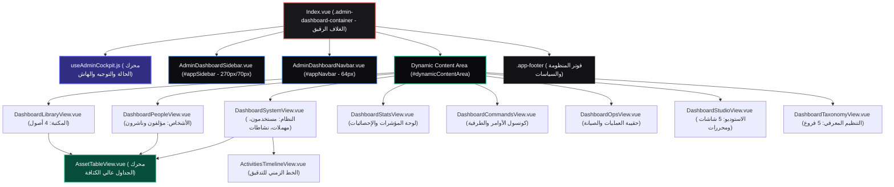

# 🗺️ خريطة النقل والتفكيك الهندسية الشاملة (Cockpit Decomposition & Mapping Blueprint)
## من ملف المعاينة المرجعي `super_admin_dashboard_preview.html` إلى بيئة `Vue 3 / Inertia.js`
### المسار المعماري المعتمد: `resources/js/Pages/AdminDashboard/`
**تاريخ التحديث المرجعي:** 2026-10-10 | **الحالة المعمارية:** الدورة 30 (Decoupled, Modular & Authoritative)

---

> ### 📌 إعلان المرجعية والمطابقة الصارمة (Alignment with Cockpit UI Inventory)
> تُقر هذه الخريطة الهندسية بمطابقتها التامة والتكاملية 1:1 مع:  
> 🔗 [`cockpit_ui_inventory.md`](file:///home/a/PhpstormProjects/EntityPostgre/.agent/frontend/cockpit_ui_inventory.md)  
> كل مكون، قطاع، مسار توجيه، جدول، أداة، ومحدد تفاعلي موثق في هذه الخريطة يعكس البنية الحقيقية المعتمدة لقمرة القيادة بعد إنجاز التفكيك المعماري الشامل (الدورات 1 إلى 30)، من **صندوق الشعار القرمزي بحرف `E` في السايدبار** وحتى **آخر وسم وروابط الدعم في الفوتر**.

---

## 🏗️ 1. الهيكل المعماري العام المفكك (Decoupled Cockpit Shell Architecture)

تتألف قمرة القيادة من غلاف معماري رقيق (`Index.vue`) يدير المكونات السيادية الثلاثة عبر محرك الحالة `useAdminCockpit.js`:



---

### أ. القائمة الجانبية الثابتة (`AdminDashboardSidebar.vue` - المعرف: `#appSidebar`)
* **ترويسة الشعار والعلامة التجارية (`.sidebar-header`):**
  * الشعار المتدرج القرمزي المشع (`.sidebar-logo`) مع حرف **`E`** الأبيض.
  * اسم النظام السيادي: `Entity` بخط عريض، مع رابط توجيه لشاشة الإحصائيات (`stats`).
* **شريط تحكم الأكورديون الفني (`#sidebarAccordionToolbar`):**
  * التسمية: أيقونة SVG + نص **`خريطة المجموعات`**.
  * زر التحكم المجزأ (`.pill-segmented-control`):
    * زر `توسيع` (`#btnExpandAll` ⟵ يفتح كافة المجموعات دفعة واحدة).
    * زر `طي` (`#btnCollapseAll` ⟵ يطوي كافة المجموعات دفعة واحدة).
* **شجرة المجموعات الـ 5 والبنود الـ 22 الكاملة (`.nav-group`):**
  1. **المجموعة 1: 📚 المكتبة الرقمية العامة (`#group-library` - الشارة: `4`):**
     * الكتب (`#nav-books` - بادج إحصائي حي `stats.books`).
     * المخطوطات (`#nav-manuscripts` - بادج حي `stats.manuscripts`).
     * الصوتيات (`#nav-audios` - بادج حي `stats.audios`).
     * المرئيات (`#nav-videos` - بادج حي `stats.videos`).
  2. **المجموعة 2: 👥 الأشخاص والجهات (`#group-entities` - الشارة: `2`):**
     * المؤلفون (`#nav-authors` - بادج حي `stats.authors`).
     * الناشرون (`#nav-publishers` - بادج حي `stats.publishers`).
  3. **المجموعة 3: 🏷️ البيانات والتنظيم المعرفي (`#group-taxonomy` - الشارة: `5`):**
     * التصنيفات (`#nav-categories` - بادج `stats.categories`).
     * الأوسمة (`#nav-tags` - بادج `stats.tags`).
     * المجموعات (`#nav-collections` - بادج `stats.collections`).
     * السلاسل (`#nav-series` - بادج `stats.series`).
     * الموضوعات (`#nav-topics` - بادج `stats.topics`).
  4. **المجموعة 4: ✍️ استوديو الكيانات والتحقيق (`#group-studio` - الشارة: `5`):**
     * الكتب (`#nav-studio-books` - بادج نصي `stats.studio_books مسودة`).
     * المخطوطات (`#nav-studio-manuscripts` - بادج نصي `stats.studio_manuscripts لوحة`).
     * الصوتيات (`#nav-studio-audios` - بادج نصي `stats.studio_audios شريحة`).
     * المرئيات (`#nav-studio-videos` - بادج نصي `stats.studio_videos مشهد`).
     * الإصدارات (`#nav-versions` - بادج سماوي مشع `stats.versions`).
  5. **المجموعة 5: 👑 الإدارة والحوكمة السيادية (`#group-sovereignty` - الشارة: `6`):**
     * الإحصائيات (`#nav-stats` - العرض الافتراضي للنظام).
     * العمليات (`#nav-ops` - أدوات الصيانة الفورية).
     * المستخدمون (`#nav-users` - بادج حي `stats.users`).
     * النشاطات (`#nav-activities` - بادج حي `stats.activities`).
     * المهملات (`#nav-deletions` - بادج حي مع مؤشر استعادة `stats.deletions`).
     * الأوامر (`#nav-commands` - كونسول موجه أوامر Artisan).
* **فيزياء الطي والتمدد:**
  * العرض الكامل: `270px` ⟵ وضع الطي: `70px`.
  * إخفاء نصوص العناوين والبادجات وشريط الأكورديون وإبقاء الأيقونات في المنتصف بدقة.

---

### ب. الشريط العلوي الثابت (`AdminDashboardNavbar.vue` - المعرف: `#appNavbar`)
* **الجناح الأيمن (`.navbar-right`):**
  * زر طي/فرد السايدبار الجانبي (`handleToggleSidebar`).
  * زر تبديل المظهر النهاري/الليلي (`#themeToggleBtn` مع أيقونة الشمس `#themeIconSun` وأيقونة القمر `#themeIconMoon`).
  * مسار التتبع ثلاثي المستويات (`.breadcrumbs`):
    * `الرئيسية` (رابط مباشر للعودة لشاشة الإحصائيات `stats`).
    * سهم فاصل زاوية SVG (`.breadcrumb-sep`).
    * `اسم المجموعة النشطة` (`#breadcrumbGroup` مثل: المكتبة، النظام، الاستوديو).
    * سهم فاصل.
    * `اسم الصفحة النشطة` (`#breadcrumbCurrent` مثل: الكتب، المستخدمون، الإحصائيات).
* **الجناح الأيسر (`.navbar-left`):**
  * صندوق البحث السريع (`.search-box` مع حقل إدخال `placeholder="بحث سريع..."`).
  * زر التنبيهات السيادية (`.nav-btn` مع أيقونة الجرس).
  * قائمة الحساب والملف الشخصي (`.user-menu-wrapper`):
    * زر الأفاتار الدائري بالحرف الأول (`#userAvatarBtn` مثل: `د` أو `م`).
    * القائمة المنسدلة التفاعلية (`#userDropdownMenu`):
      * الاسم: `د. إبراهيم الفاسي` (أو اسم المستخدم من Inertia Auth).
      * البريد: `super_admin@archive.org`.
      * رابط لوحة التحكم الرئيسية (`/superadmin/dashboard`).
      * زر تسجيل الخروج التحذيري (`.text-danger`).
    * مستمع النقر الخارجي (`handleDocumentClick`) للإغلاق التلقائي.

---

### ج. تذييل الصفحة والعلامة التجارية (`.app-footer` في `Index.vue`)
* نص حقوق الملكية: `© 2026 Entity App. جميع الحقوق محفوظة.`
* روابط الدعم الفني (`support@entity.local`) وسياسة الخصوصية.

---

## 📊 2. تفكيك منظومة جداول الأصول المشتركة المتقدمة (`AssetTableView` Subsystem)
### المكون المركزي: `resources/js/Components/Table/AssetTableView.vue`

تعتمد كافة جداول المكتبة والأشخاص والنظام على هذه المنظومة الموحدة والمؤلفة من 6 مكونات فرعية:

```
┌────────────────────────────────────────────────────────────────────────┐
│ 1. البانر الأرشيفي وشريط الـ Micro-KPI التفاعلي (AssetHeaderBanner.vue) │
├────────────────────────────────────────────────────────────────────────┤
│ 2. شريط الأدوات: البحث + الفلاتر + منتقي الأعمدة + نمط العرض (جدول/بطاقات) │
├────────────────────────────────────────────────────────────────────────┤
│ 3. شريط الإجراءات الجماعية المنزلق (BulkActionsStrip.vue عند التحديد)   │
├────────────────────────────────────────────────────────────────────────┤
│ 4. الجدول عالي الكثافة (DenseDataTable.vue) / شبكة البطاقات البديلة    │
├────────────────────────────────────────────────────────────────────────┤
│ 5. شريط الترقيم المورق (TablePagination.vue مع محدد 10/25/50/100)       │
├────────────────────────────────────────────────────────────────────────┤
│ 6. نافذة الربط التصنيفي متعدد الأشكال (Polymorphic Taxonomy Modal)     │
└────────────────────────────────────────────────────────────────────────┘
```

---

### أ. ترويسة الأصل وشريط المؤشرات المصغر (`AssetHeaderBanner.vue`)
1. **عنوان الأصل والأيقونة والتوصيف الأرشيفي:** تمييز بصري لكل كيان.
2. **شريط المؤشرات المصغر التفاعلي (Interactive Micro KPI Bar):**
   - **الكل (Total):** إجمالي الأصول المفهرسة.
   - **منشور (Published):** الأصول المعتمدة للنشر العام.
   - **محكّم (Scholarly):** الأصول المدققة علمياً.
   - **مسودة (Draft):** المسودات وقيد التحقيق.
   * *آلية التفاعل:* النقر المباشر على أي مؤشر يفلتر بيانات الجدول لحظياً (`all`, `published`, `scholarly`, `draft`).

---

### ب. شريط أدوات الجدول الذكي (`TableToolbar.vue`)
* **صندوق البحث الفوري:** فلترة نصية لحظية لكافة حقول الصفوف.
* **قوائم الفلاتر والتصنيف:** فلترة الأصول حسب الفئات أو الأوسمة.
* **أداة تخصيص إظهار الأعمدة (Column Visibility Picker):**
  - قائمة منسدلة تحتوي على Checkboxes لجميع الأعمدة القابلة للإخفاء.
  - تمكين المشرف من التحكم الكامل بما يظهر على الشاشة وحفظ التفضيل.
  - زر **`إعادة ضبط الأعمدة`** لاستعادة التوزيع الافتراضي.
* **مبدل نمط العرض (View Mode Switcher):** التبديل بين وضع الجدول عالي الكثافة (Table) ووضع شبكة البطاقات (Cards).
* **شبكة الأزرار التنفيذية الأربعة:**
  - زر **`+ إضافة [أصل]`** (مرتبط برابط الإنشاء مثل `/books/create`).
  - زر **`تصدير`** (Export Data).
  - زر **`استيراد`** (Import Data).
  - زر **`تحديث`** (Instant Refresh).

---

### ج. شريط الإجراءات الجماعية المنزلق (`BulkActionsStrip.vue`)
* ينزلق بنعومة فور تحديد صف واحد أو أكثر عبر مربعات الاختيار.
* يتضمن: عداد العناصر المحددة، زر `تحديد الكل`، زر `إلغاء التحديد`، زر `تصدير المحدد`، وزر `حذف المحدد` القرمزي.

---

### د. الجدول عالي الكثافة (`DenseDataTable.vue`)
* رؤوس أعمدة قابلة للفرز التصاعدي والتنازلي مع أسهم ⇅.
* دعم مربعات الاختيار الفردية والماستر (`#masterCheckbox`).
* شارات الحالة الملونة (منشور بالزمردي، محكم بالأزرق، مسودة بالعنبري).
* أزرار الإجراءات لكل صف (معاينة، تعديل، ربط تصنيفي، وحذف).

---

### هـ. شريط الترقيم المورق (`TablePagination.vue`)
* محدد كثافة السجلات: خيارات `10`، `25`، `50`، `100` سطر.
* عداد النطاق الرقمي: "عرض X إلى Y من إجمالي Z كياناً".
* أزرار التنقل بين الصفحات والقفز السريع.

---

### و. نافذة الربط التصنيفي متعدد الأشكال (Polymorphic Taxonomy Modal - الدورة 22)
* نافذة Modal تفاعلية منبثقة لربط أي أصل بأوعية التصنيف الخمسة:
  - 📦 المجموعات (`Collections`)
  - 📚 السلاسل (`Series`)
  - 💡 الموضوعات (`Topics`)
  - 🏷️ الأوسمة (`Tags`)
  - 📁 التصنيفات (`Categories`)

---

## 🧩 3. تفكيك الشاشات الـ 22 في `viewCatalog` ومكوناتها في قمرة القيادة

يتم تصيير الشاشات الـ 22 عبر 8 مكونات قطاعية مفككة (`Decoupled SFC Views`) داخل `#dynamicContentArea`:

### أولاً: قطاع المكتبة الرقمية العامة (General Library - `DashboardLibraryView.vue`)
1. **`books` (الكتب):** جداول وبيانات الكتب والرسائل، شريط الـ KPI، ورابط `/books/create`.
2. **`manuscripts` (المخطوطات):** جداول المخطوطات النادرة وتفاصيل الخزائن واللوحات، ورابط `/manuscripts/create`.
3. **`audios` (الصوتيات):** جداول التسجيلات الصوتية ومعدل البت والتردد والمدد، ورابط `/audios/create`.
4. **`videos` (المرئيات):** جداول المحاضرات والندوات المصورة والدقة (4K/HD)، ورابط `/videos/create`.

### ثانياً: قطاع الأشخاص والجهات (Entities & Biographies - `DashboardPeopleView.vue`)
5. **`authors` (المؤلفون):** جدول الأعلام عالي الكثافة (Dense Table Mode)، الرتبة العلمية، العصر، والمصنفات، ورابط `/authors/create`.
6. **`publishers` (الناشرون):** جدول دور النشر والمؤسسات (Dense Table Mode)، المقر، عدد المطبوعات، ورابط `/publishers/create`.

### ثالثاً: قطاع التنظيم والمعرفة (Taxonomies - `DashboardTaxonomyView.vue`)
7. **`categories` (التصنيفات):** الشجرة الهرمية للعلوم مع عقد الربط وعقد التفرع، وزر `+ تصنيف جديد` (`/categories/create`).
8. **`tags` (الأوسمة):** سحابة الأوسمة الدلالية مع أوزان بصرية متناسبة، وزر `+ وسم جديد` (`/tags/create`).
9. **`collections` (المجموعات):** بطاقات المحافظ الأرشيفية، شارات الخصوصية (عامة/خاصة)، وتفصيل الأصول المربوطة، وزر `+ مجموعة جديدة` (`/collections/create`).
10. **`series` (السلاسل):** خطوط متسلسلة للمجلدات والأجزاء وترقيمها، وزر `+ سلسلة جديدة` (`/series/create`).
11. **`topics` (الموضوعات):** مكنز رؤوس الموضوعات والمسائل التخصصية الدقيقة، وزر `+ موضوع جديد` (`/topics/create`).

### رابعاً: قطاع استوديو الكيانات والمحررات (Entity Studio - `DashboardStudioView.vue`)
12. **`studio-books` (استوديو الكتب):** متابعة مسار التحرير ونسبة الإنجاز والمقابلة، مع شريط أدوات ومبدل نمط العرض (جدول ↔ بطاقات)، وزر استئناف التحرير (`/studio/resume`).
13. **`studio-manuscripts` (استوديو المخطوطات):** منصة مقارنة اللوحات الخطية وفك الطلاسم وتفريغ النصوص.
14. **`studio-audios` (استوديو الصوتيات):** تجزئة المسارات وتوليد الشرائح وتفريغ النصوص.
15. **`studio-videos` (استوديو المرئيات):** تقسيم الندوات والمشاهد وربط الفصول التفاعلية.
16. **`versions` (سجل الإصدارات والمقارنات):** جدول النسخ وتاريخ التعديل ومقارنة الفروق النصية.

### خامساً: قطاع السيادة والحوكمة (Sovereignty & Governance)
17. **`stats` (لوحة القيادة المركزية Overview - `DashboardStatsView.vue`):**
    * شريط الترحيب والنبض الحي (النظام يعمل بكفاءة + استقرار PostgreSQL).
    * شبكة بطاقات الـ KPI الرئيسية الأربع (كتب، مخطوطات، صوتيات، مرئيات) بأشرطة نسب متقدمة وإمكانية النقر للانتقال.
    * منصة الإطلاق السريع (`.quick-launch-grid`) بأيقونات ومسارات مباشرة.
    * قمع مسار تدفق النشر والتحقيق الهرمي (`.funnel-container` من المسودة وحتى النشر العام).
18. **`ops` (العمليات والصيانة الفورية - `DashboardOpsView.vue`):**
    * زر إرسال إشارة الأمان للجلسات.
    * بطاقة وضع الصيانة المؤسسي (Maintenance Mode).
    * بطاقات الصيانة الفورية (أخذ نسخة احتياطية Snapshot، تفريغ الكاش ومزامنة السياسات Spatie، إعادة بناء فهارس البحث، كونسول أوامر النظام).
19. **`users` (المستخدمون ورتب الصلاحيات - `DashboardSystemView.vue`):**
    * جدول المستخدمين عبر `AssetTableView` مع شارات الرتب المؤسسية (`chip-super`, `chip-admin`, `chip-editor`, `chip-user`) وتاريخ الانضمام.
20. **`activities` (سجل التدقيق الحي Audit Log - `ActivitiesTimelineView.vue`):**
    * الخط الزمني الرأسي المتصل (`.timeline-rail`) مع حقل بحث خاص، وشارات أفاتار المستخدمين، وتفاصيل الأحداث لحظياً من PostgreSQL، ورابط `/activities`.
21. **`deletions` (خزنة المهملات والاستعادة - `DashboardSystemView.vue`):**
    * جدول المحذوفات الرخوة عبر `AssetTableView` مع مؤقت الأيام المتبقية وزر **`استعادة الكيان ♻️`**.
22. **`commands` (كونسول موجه أوامر النظام - `DashboardCommandsView.vue`):**
    * شبكة الأوامر السيادية الـ 7 المخصصة بنقرة واحدة.
    * محطة الأوامر الطرفية التفاعلية بنمط macOS مع مخرجات خادم Laravel عبر API `/api/system/run-command` وحقل الإدخال `#cmdInput`.

---

## ⚙️ 4. محرك إدارة الحالة الموحد (`useAdminCockpit.js` Engine)
### المسار المعتمد: `resources/js/Composables/useAdminCockpit.js` (الدورة 30)

تم استخراج وتوحيد كافة دوال المنظومة في Composable سيادي مرجعي واحد يغني عن التشتت:

| المجال الوظيفي | الدوال والخصائص المصدرة | الوظيفة الدقيقة |
| :--- | :--- | :--- |
| **كتالوج العروض** | `viewCatalog` | قاموس صارم يربط الشاشات الـ 22 بعناوينها ومجموعاتها الأم. |
| **الحالة التفاعلية** | `currentViewKey`, `currentViewHtml`, `isSidebarCollapsed`, `isDarkMode` | المتغيرات التفاعلية الموجهة لكامل القشرة. |
| **العناوين المشتقة** | `currentGroupTitle`, `currentViewTitle` | توليد مسار الـ Breadcrumbs تلقائياً بناءً على الصفحة النشطة. |
| **محللات بيانات القطاعات** | `getLibraryItems`, `getPeopleItems`, `getStudioItems`, `getTaxonomyItems` | استخراج وتصفية البيانات الممررة من الـ Props وتوجيهها للمكونات. |
| **التوجيه والهاش** | `loadView(viewKey)` | تحديث الصفحة وتزامن الرابط عبر `replaceState` وحركات الانتقال `translateY(6px)` السلسة. |
| **الأكورديون والقائمة** | `toggleNavGroup`, `expandAllGroups`, `collapseAllGroups`, `updateToolbarState` | إدارة فتح وطي مجموعات السايدبار وحالة أزرار شريط الأكورديون. |
| **طي السايدبار** | `toggleSidebarCollapse()` | تقليص عرض السايدبار بين 270px و 70px وضبط هوامش النافبار والمحتوى. |
| **المظهر والثيم** | `initTheme()`, `toggleTheme()`, `setTheme(dark)` | التبديل بين الوضعين الليلي والنهاري وتخزين التفضيل في `localStorage`. |
| **قائمة المستخدم** | `toggleUserDropdown()` | فتح وإغلاق قائمة الملف الشخصي مع مستمع للنقر الخارجي. |
| **جسر النوافذ العالمي** | `window.loadView`, `window.runCmd`... | تصدير دوال التحكم لكائن `window` لتمكين الفحص الآلي واختبارات القبول. |

---

## 🚦 5. مصفوفة الجاهزية التشغيلية الحقيقية (Real Implementation vs Mock Status)

انطلاقاً من مبدأ الشفافية الهندسية الصارمة، توثق هذه الخريطة الموقف التشغيلي الفعلي لكافة القطاعات:

| القطاع أو الأداة | نسبة الجاهزية الحقيقية | الحالة البرمجية والربط الفعلي |
| :--- | :---: | :--- |
| **غلاف القمرة ومحرك الحالة (`useAdminCockpit`)** | **100%** | معمارية مفككة بالكامل، 13 ملف اختبار Vitest، صفر انكسار. |
| **السايدبار الموحد وشريط الأكورديون** | **100%** | تفاعلي بالكامل، شارات حية، وطي سلس. |
| **شريط التنقل العلوي (النافبار) كغلاف** | **100%** | مسار تتبع ثلاثي ديناميكي، وتبديل ثيم حقيقي في `localStorage`. |
| **قطاع المكتبة (الكتب)** | **100%** | ربط حي بقاعدة PostgreSQL عبر Eloquent و AssetTableView. |
| **محرك الجداول المشترك (`AssetTableView`)** | **100%** | مكتمل بـ 6 مكونات فرعية، أعمدة ديناميكية، وترقيم مورق. |
| **كونسول أوامر النظام (`commands`)** | **100%** | متصل بـ API حقيقي `/api/system/run-command` مع تنفيذ Artisan. |
| **سجل النشاطات (`activities`)** | **100%** | متصل ببيانات PostgreSQL الحية والخط الزمني الرأسي. |
| **مستخدمو النظام وسلة المهملات** | **100%** | متصلة ببيانات حية وأدوار Spatie واستعادة رخوة. |
| **أدوات النافبار (البحث المركزي والإشعارات)** | **0%** | البحث غير مستمع إليه في `Index.vue`، وجرس الإشعارات مجرد `alert`. |
| **تسجيل الخروج في قائمة الحساب** | **0%** | ينفذ `location.reload()` و `alert` بدلاً من مسار `POST /logout`. |
| **أدوات الصيانة في حقيبة العمليات (`ops`)** | **25%** | زر تفريغ الكاش متصل بالـ API، بينما النسخ الاحتياطي ووضع الصيانة وإعادة الفهارس مجرد `alert`. |
| **تذييل الصفحة (الفوتر)** | **0%** | كود HTML بدائي في قاع `Index.vue` وروابطه مجرد `alert(...)`. |
| **مسار الاستئناف في الاستوديو** | **0%** | زر `استئناف التحرير` يشير إلى مسار غير مسجل: `/studio/resume`. |

---

> **خلاصة الاعتماد والمطابقة:**  
> تمثل هذه الوثيقة المخطط الهندسي التفكيكي المعتمد لبيئة الإنتاج، والمطابق تماماً للمرجع التشريحي في `cockpit_ui_inventory.md`، مع بيان دقيق للمنجز المعماري ومواقع العمل المستهدفة في الدورات القادمة.
