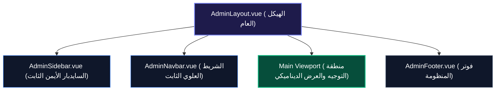

# 🗺️ خريطة النقل والتفكيك الهندسية الشاملة (Cockpit Decomposition & Mapping Blueprint)
## من ملف المعاينة المرجعي `super_admin_dashboard_preview.html` إلى بيئة `Vue 3 / Inertia.js`
### منصة الأرشيف الرقمي الموحد — Entity Digital Library

---

> ### 📌 إعلان المرجعية المطلقة (Single Source of Truth - SSOT)
> يُقر هذا المخطط بأن ملف:  
> 🔗 [`public/super_admin_dashboard_preview.html`](file:///home/a/PhpstormProjects/EntityPostgre/public/super_admin_dashboard_preview.html)  
> هو **المرجع البصري والوظيفي والتفاعلي الحاكم والأوحد** لكافة واجهات قمرة قيادة السوبر أدمن.  
> كل مكون، ترويسة، كلاس CSS، لون، تأثير زجاجي، خط مونو-سبيس، شارة، نافذة منبثقة، دالة جافاسكريبت، أو صف جدول يتم بناؤه في بيئة `Vue 3 / Inertia` هو استنساخ ونقل دقيق ومطابق 1:1 لما ورد في هذا الملف دون إسقاط أي حرف أو تفصيلة.

---

## 🏗️ 1. تفكيك الهيكل العام الثابت (Fixed Global Shell Architecture)

يتألف الهيكل العام من ثلاثة مكونات رئيسية تحيط بمنطقة العرض الديناميكي:



### أ. السايدبار الأيمن الثابت (`.app-sidebar` ⟵ `AdminSidebar.vue`)
* **الترويسة (`.sidebar-header`):**
  * الشعار المتدرج الأرجواني الوردي (`.sidebar-logo`) مع حرف `E`.
  * اسم النظام: `Entity` بخط `Outfit` بوزن 900.
* **شريط التحكم الفني في الأكورديون (`.sidebar-accordion-toolbar`):**
  * التسمية: `خريطة المجموعات` مع أيقونة الـ SVG.
  * زر التحكم المجزأ (`.pill-segmented-control`):
    * زر `توسيع` (`#btnExpandAll` ⟵ `expandAllGroups()`).
    * زر `طي` (`#btnCollapseAll` ⟵ `collapseAllGroups()`).
* **المجموعات الخمس التراكمية (`.nav-group` ⟵ `SidebarNavGroup.vue`):**
  1. **المجموعة 1: 📚 المكتبة (`#group-library`):**
     * الكتب (`#nav-books` - بادج 1,482).
     * المخطوطات (`#nav-manuscripts` - بادج 428).
     * الصوتيات (`#nav-audios` - بادج 650).
     * المرئيات (`#nav-videos` - بادج 185).
  2. **المجموعة 2: 👥 الأشخاص (`#group-entities`):**
     * المؤلفون (`#nav-authors` - بادج 340).
     * الناشرون (`#nav-publishers`).
  3. **المجموعة 3: 🏷️ التنظيم (`#group-taxonomy`):**
     * التصنيفات (`#nav-categories`).
     * الأوسمة (`#nav-tags`).
  4. **المجموعة 4: ✍️ الاستوديو (`#group-studio`):**
     * الكتب (`#nav-studio-books` - بادج 386 مسودة).
     * المخطوطات (`#nav-studio-manuscripts` - بادج 114 لوحة).
     * الصوتيات (`#nav-studio-audios` - بادج 92 شريحة).
     * المرئيات (`#nav-studio-videos` - بادج 45 مشهد).
     * الإصدارات (`#nav-versions` - بادج 842 بلون سماوي).
  5. **المجموعة 5: 👑 النظام - القطاع السيادي (`.sovereign-group` `#group-sovereignty`):**
     * الإحصائيات (`#nav-stats`).
     * العمليات (`#nav-ops`).
     * المستخدمون (`#nav-users` - بادج 124).
     * النشاطات (`#nav-activities`).
     * المهملات (`#nav-deletions` - بادج 18).
     * الأوامر (`#nav-commands`).
* **آلية الطي والتمدد للسايدبار بالكامل:**
  * العرض الكامل: `270px` ⟵ عند الطي: `70px`.
  * إخفاء العناوين والبادجات وإبقاء الأيقونات في المنتصف بدقة.

---

### ب. الشريط العلوي الثابت (`.app-navbar` ⟵ `AdminNavbar.vue`)
* **الجهة اليمنى (`.navbar-right`):**
  * زر طي/فرد السايدبار الجانبي (`toggleSidebarCollapse()`).
  * زر مبدل المظهر النهاري/الليلي (`#themeToggleBtn` ⟵ `toggleTheme()` مع أيقونات الشمس `#themeIconSun` والقمر `#themeIconMoon`).
  * شريط المسار الثلاثي (`.breadcrumbs` ⟵ `Breadcrumbs.vue`):
    * `الرئيسية` (رابط لقسم الإحصائيات).
    * سهم فاصل معكوس لليمين (`.breadcrumb-sep`).
    * `اسم المجموعة الحالية` (`#breadcrumbGroup` مثل: المكتبة).
    * سهم فاصل.
    * `اسم الصفحة الحالية النشطة` (`#breadcrumbCurrent` مثل: الكتب).
* **الجهة اليسرى (`.navbar-left`):**
  * صندوق البحث السريع البيضاوي (`.search-box` مع أيقونة البحث).
  * زر التنبيهات مع أيقونة الجرس (`.nav-btn`).
  * قائمة الحساب والملف الشخصي (`.user-menu-wrapper` ⟵ `UserDropdown.vue`):
    * زر الصورة الرمزية الدائرية بالأحرف الأولى (`.user-avatar-inner`: `م`).
    * القائمة المنسدلة الزجاجية (`#userDropdownMenu`):
      * الاسم: `د. إبراهيم الفاسي`.
      * البريد: `super_admin@archive.org`.
      * رابط لوحة التحكم الرئيسية (`/dashboard`).
      * خيار تسجيل الخروج باللون الأحمر التحذيري (`.text-danger`).

---

### ج. فوتر المنظومة (`.app-footer` ⟵ `AdminFooter.vue`)
* نص الحقوق: `© 2026 Entity App. جميع الحقوق محفوظة.`
* روابط الدعم وسياسة الخصوصية.

---

## 📊 2. تفكيك مكونات جداول الأصول الأربعة عالي الكثافة (Enterprise Asset Tables Engine)

كل أصل من الأصول الأربعة (كتب، مخطوطات، صوتيات، مرئيات) يتبع نفس البنية الهندسية الثلاثية الموحدة:

```
┌────────────────────────────────────────────────────────────────────────┐
│ 1. البانر الأفقي المقسم: بطاقات الـ KPI (يميناً) + شبكة الأزرار 2×2 (يساراً) │
├────────────────────────────────────────────────────────────────────────┤
│ 2. شريط الأدوات: البحث + الفلاتر + منتقي الأعمدة 1:1 + نمط العرض (جدول/بطاقات) │
├────────────────────────────────────────────────────────────────────────┤
│ 3. شريط الإجراءات الجماعية المنبثق (Bulk Actions Strip عند تحديد الصفوف)   │
├────────────────────────────────────────────────────────────────────────┤
│ 4. الجدول عالي الكثافة (Dense Table 1:1) / شبكة البطاقات البديلة        │
├────────────────────────────────────────────────────────────────────────┤
│ 5. شريط الترقيم المتقدم (Pagination Bar مع عدد السجلات والقفز السريع)   │
└────────────────────────────────────────────────────────────────────────┘
```

---

### أ. البانر الأفقي المقسم (`.horizontal-header-banner` ⟵ `AssetHeaderBanner.vue`)
1. **دِف اليمين (`.banner-kpi-col`):**
   * 4 بطاقات إحصائية أفقية مضغوطة (`.kpi-h-card`):
     - البطاقة 1: **الكل** (إجمالي الأرشيف مع النسبة 100%).
     - البطاقة 2: **منشور** (أخضر زمردي `.val-published`).
     - البطاقة 3: **محكّم / معتمد** (أزرق `.val-scholarly`).
     - البطاقة 4: **مسودات / استوديو** (عنبري `.val-draft`).
   * كل بطاقة تحتوي شريط إنجاز رفيع (`.kpi-h-bar`)، ودالة فلترة لحظية عند النقر (`setQuickStatusFilter()`).
2. **دِف اليسار (`.banner-actions-col`):**
   * شبكة أزرار تنفيذية مربعة 2 × 2 متناسقة تماماً مع ارتفاع البطاقات:
     - زر الإضافة الرئيسي المتوهج (`.btn-grid-primary` مع علامة `+`).
     - زر تصدير الفهرس (`.btn-grid-secondary` مع أيقونة التصدير الزرقاء).
     - زر الاستيراد الجماعي (`.btn-grid-secondary` مع أيقونة الاستيراد الخضراء).
     - زر تحديث وإعادة الفهرسة (`.btn-grid-secondary` مع أيقونة التحديث الصفراء).

---

### ب. شريط أدوات الجدول (`.table-toolbar` ⟵ `TableToolbar.vue`)
* صندوق البحث اللحظي (`.toolbar-search-input` مع أيقونة المكبرة ودعم الـ Debounce).
* قوائم الفلاتر المنسدلة (`.toolbar-select` بتصميم مخصص وسهم أنيق لا ينكسر في الوضعين):
  - فلتر التصنيف / الترتيب / الجودة / الخط.
* مبدل نمط العرض (`.view-mode-toggle` ⟵ `ViewModeToggle.vue`):
  - زر `جدول` (`.view-mode-btn.active`).
  - زر `بطاقات` (`.view-mode-btn`).
* **منتقي الأعمدة المنسدل (`.columns-picker-wrapper` ⟵ `ColumnsDropdown.vue`):**
  - زر `الأعمدة` مع أيقونة التخطيط الشبكي.
  - قائمة منسدلة زجاجية ذات شريط تمرير نحيف أنيق بحد أقصى `260px` لا تتجاوز حدود الشاشة.
  - خيارات تفعيل وإلغاء الأعمدة بربط دالّة `toggleColumnVisibility(colIndex, isVisible, tableId)`.
  - زر `إظهار الكل` السفلي (`resetAllColumns()`).

---

### ج. شريط الإجراءات الجماعية (`.bulk-actions-strip` ⟵ `BulkActionsStrip.vue`)
* يظهر تلقائياً بتأثير انزلاق عند تحديد صف واحد أو أكثر (`#bulkSelectedCount`).
* يتضمن زري: `تصدير المحدد`، و`حذف المحدد` (باللون الأحمر الكريمسوني).

---

### د. الجداول عالي الكثافة ومصفوفة المطابقة مع جداول المايجريشن 1:1 (`DenseDataTable.vue`)

#### 1. جدول الكتب (`booksDataTable` - إجمالي 10 أعمدة):
1. `[Checkbox]` (تحديد فردي وجماعي عبر `#masterCheckbox`).
2. `الرقم ⇅` (`serial_number` مونو-سبيس `#10401`).
3. `العنوان ⇅` (`title` رابط مباشر عريض `.book-title-link`).
4. `المعرف ⇅` (`slug` مونو-سبيس نيلي).
5. `المؤلف ⇅` (`author` اسم العلم بخط عريض ورابط).
6. `الرقم الدولي ⇅` (`isbn` مونو-سبيس رمادي).
7. `الوصف` (`description` محصور بسطرين عبر `.cell-desc` مع tooltip).
8. `الملفات` (`cover_path` + `file_path` بادجات غلاف + PDF).
9. `التاريخ ⇅` (`created_at` مثل "منذ ساعتين").
10. `الإجراءات` (قارئ 📖، استوديو ✍️، تعديل ⚙️، سلة المهملات 🗑️).

#### 2. جدول المخطوطات (`manuscriptsDataTable` - إجمالي 24 عموداً):
1. `[Checkbox]`.
2. `الرقم ⇅` (`serial_number`).
3. `الكود ⇅` (`code` مونو-سبيس نيلي مثل `MS-KOP-01`).
4. `العنوان ⇅` (`title` رابط للمعمل).
5. `العنوان الأصلي ⇅` (`original_title`).
6. `الفهرس ⇅` (`catalog_number` رقم الحفظ الخزائني).
7. `الأجزاء ⇅` (`parts`).
8. `بخطه ⇅` (`is_autograph` شارات: `✍️ أوتوغراف` / `✍️ بخط التلميذ` / `مقابلة`).
9. `الناسخ ⇅` (`scribe`).
10. `تاريخ النسخ ⇅` (`copy_date` مثل `698هـ`).
11. `القرن ⇅` (`manuscript_century` مثل `القرن 7هـ`).
12. `الخط ⇅` (`script_type` شارات دور: نسخ أندلسي، كوفي مشرقي، إلخ).
13. `الأبعاد ⇅` (`dimensions` مثل `29 × 21 سم`).
14. `الأسطر ⇅` (`lines_per_page` مثل `25 سطر`).
15. `الأوراق ⇅` (`pages` مثل `342 ورقة`).
16. `الخزانة ⇅` (`location` اسم المكتبة الخزائنية).
17. `الوصف` (`description` محصور بسطرين).
18. `التقييدات` (`inscriptions` سماعات ومقابلات بخط الأئمة).
19. `الفاتحة` (`manuscript_start` نص بداية المخطوط).
20. `الخاتمة` (`manuscript_end` نص نهاية المخطوط).
21. `الملاحظات` (`notes` تعليقات الفحص).
22. `الملفات` (`cover_path` + `file_path` بادجات غلاف + لوحات).
23. `تاريخ الإضافة ⇅` (`created_at`).
24. `الإجراءات` (معمل فحص 🔬، استوديو ✍️، تعديل ⚙️، حذف 🗑️).

#### 3. جدول الصوتيات (`audiosDataTable` - إجمالي 14 عموداً):
1. `[Checkbox]`.
2. `الرقم ⇅` (`serial_number`).
3. `العنوان ⇅` (`title`).
4. `الكود ⇅` (`code` مثل `AUD-ABD-01`).
5. `المعرف ⇅` (`slug`).
6. `المدة ⇅` (`duration` مونو-سبيس عريض مثل `01:24:15`).
7. `الصيغة ⇅` (`format` شارة نظيفة `MP3`).
8. `معدل البت ⇅` (`bitrate` مونو-سبيس مثل `320 kbps`).
9. `التردد ⇅` (`sample_rate` مثل `44.1 kHz`).
10. `الحجم ⇅` (`file_size` مثل `115 MB`).
11. `الوصف` (`description` محصور بسطرين).
12. `الملفات` (`cover_path` + `file_path` بادجات غلاف + صوتي).
13. `التاريخ ⇅` (`created_at`).
14. `الإجراءات` (مشغل 🎧، استوديو ✍️، تعديل ⚙️، حذف 🗑️).

#### 4. جدول المرئيات (`videosDataTable` - إجمالي 11 عموداً):
1. `[Checkbox]`.
2. `الرقم ⇅` (`serial_number`).
3. `العنوان ⇅` (`title`).
4. `الكود ⇅` (`code` مثل `VID-NDW-01`).
5. `المعرف ⇅` (`slug`).
6. `المدة ⇅` (`duration` مونو-سبيس عريض مثل `02:15:00`).
7. `الصيغة ⇅` (`format` شارات: `MP4 4K` / `MP4 1080p`).
8. `الوصف` (`description` محصور بسطرين).
9. `الملفات` (`cover_path` + `file_path` بادجات غلاف + فيديو).
10. `التاريخ ⇅` (`created_at`).
11. `الإجراءات` (مشغل ▶️، استوديو ✍️، تعديل ⚙️، حذف 🗑️).

---

### هـ. شريط الترقيم المتقدم (`.table-pagination-bar` ⟵ `TablePagination.vue`)
* بيان السجلات: `عرض X - Y من أصل Z كياناً`.
* قائمة منسدلة لحجم الصفحة: `25 في الصفحة`، `50`، `100`، `250`.
* أزرار التنقل: البداية `««`، السابق `‹`، أرقام الصفحات النشطة، التالي `›`، النهاية `»»`.
* مربع القفز المباشر لرقم الصفحة مع زر `انتقال`.

---

## 🧩 3. تفكيك الشاشات الـ 19 في `viewCatalog` إلى صفحات Inertia

كل شاشة من الشاشات المعرفة في كائن `viewCatalog` يتم نقلها إلى مسار وصفحة Inertia متكاملة:

### أولاً: قطاع المكتبة الرقمية العامة (General Library)
1. **`books`:** ⟵ `Pages/Admin/Books/Index.vue`
2. **`manuscripts`:** ⟵ `Pages/Admin/Manuscripts/Index.vue`
3. **`audios`:** ⟵ `Pages/Admin/Audios/Index.vue`
4. **`videos`:** ⟵ `Pages/Admin/Videos/Index.vue`

### ثانياً: قطاع الأشخاص والجهات (Entities & Biographies)
5. **`authors` (المؤلفون):** ⟵ `Pages/Admin/Authors/Index.vue`
   * ترويسة مع زر `+ مؤلف جديد` وزر `الترتيب الزمني ⏳`.
   * شبكة بطاقات الأعلام (`.catalog-grid`):
     - شارة الرتبة العلمية (مثل: أمير المؤمنين في الحديث 🏛️).
     - اسم العلم وتواريخ الولادة والوفاة (`773 - 852 هـ`).
     - بادجات عدد المصنفات بالأرشيف والمدينة.
     - نبذة السيرة مع زر تصفح المؤلفات وزر تعديل السيرة.
6. **`publishers` (الناشرون):** ⟵ `Pages/Admin/Publishers/Index.vue`
   * ترويسة مع زر `+ دار نشر`.
   * شبكة بطاقات دور النشر (المقر، عدد المطبوعات، تاريخ التأسيس، زر عرض المنشورات).

### ثالثاً: قطاع التنظيم والمعرفة (Taxonomies)
7. **`categories` (التصنيفات):** ⟵ `Pages/Admin/Categories/Index.vue`
   * شجرة العلوم الهرمية التفاعلية (`.tree-node` و `.tree-node.child`):
     - الجذر الأساسي: العلوم الشرعية الإسلامية.
     - الفروع: الحديث، الفقه، السيرة، إلخ مع عداد الكيانات التابعة.
8. **`tags` (الأوسمة):** ⟵ `Pages/Admin/Tags/Index.vue`
   * سحابة الكلمات المفتاحية والأوسمة التراثية المتدرجة بالألوان والعدادات.

### رابعاً: قطاع استوديو الكيانات والمحررات (Entity Studio & Curation)
9. **`studio-books`:** ⟵ `Pages/Admin/Studio/Books.vue`
   * جدول تقدم التحقيق: المصنف، العقدة الحالية، شريط نسبة الإنجاز الملون، المحقق، وزر فتح المحرر.
10. **`studio-manuscripts`:** ⟵ `Pages/Admin/Studio/Manuscripts.vue`
    * جدول تدقيق اللوحات: المخطوطة، رقم اللوحة، حالة المقابلة، المحقق، زر متابعة التحقيق.
11. **`studio-audios`:** ⟵ `Pages/Admin/Studio/Audios.vue`
    * جدول تفريغ المجالس الصوتية: المجلس، المدة، الشرائح المنجزة، نسبة دقة المطابقة.
12. **`studio-videos`:** ⟵ `Pages/Admin/Studio/Videos.vue`
    * جدول تقطيع المشاهد والمحاضرات: التسجيل، المدة، عدد الفصول، زر التقطيع.
13. **`versions` (محرك الإصدارات وتاريخ التعديل):** ⟵ `Pages/Admin/Studio/Versions.vue`
    * صندوق مقارنة الفروق اللحظية (`.diff-box` بالأحمر للنصوص المحذوفة والأخضر للتصويبات).
    * جدول النسخ السابقة مع زر الاسترجاع المباشر (`studio.restore`).

### خامساً: قطاع السيادة والحوكمة (Sovereignty & Governance)
14. **`stats` (لوحة القيادة المركزية Overview):** ⟵ `Pages/Admin/Dashboard.vue`
    * مؤشر اتصال واستقرار قاعدة البيانات النبضي (`pulse`).
    * شبكة بطاقات الـ KPI الرئيسية الأربع (كتب، مخطوطات، صوتيات، مرئيات) مع أشرطة النسب المتعددة.
    * منصة الإطلاق السريع (`.quick-launch-grid` بأيقونات ملونة ومسارات مباشرة).
    * قمع مسار تدفق النشر والتحقيق (`.funnel-container` من المسودة وحتى النشر العام).
15. **`ops` (العمليات والصيانة الفورية):** ⟵ `Pages/Admin/Operations/Index.vue`
    * زر إشارة الأمان للجلسات.
    * بطاقة وضع الصيانة المؤسسي الملونة بالعنبري مع زر التفعيل/التعطيل.
    * أدوات الصيانة الفورية (نسخ احتياطي Snapshot، تفريغ الكاش ومزامنة الصلاحيات، إعادة بناء فهارس البحث).
16. **`users` (المستخدمون ورتب الصلاحيات):** ⟵ `Pages/Admin/Users/Index.vue`
    * جدول المستخدمين مع شارات الأدوار المؤسسية الـ 12 وحالة الحساب وأزرار تعديل الصلاحية.
17. **`activities` (سجل التدقيق الحي Audit Log):** ⟵ `Pages/Admin/Activities/Index.vue`
    * المخطط الزمني الرأسي المتصل (`.timeline-container` مع السكة المضيئة `.timeline-rail` والنقاط الملونة بحسب نوع الحدث: إجازة نشر، حفظ مسودة، تحكيم علمي، مزامنة شرائح).
18. **`deletions` (خزنة المهملات والاستعادة):** ⟵ `Pages/Admin/Deletions/Index.vue`
    * جدول المحذوفات المؤقتة مع مؤقت الأيام المتبقية وزر الاستعادة الفورية `♻️`.
19. **`commands` (طرفية موجه أوامر النظام):** ⟵ `Pages/Admin/System/Commands.vue`
    * شاشة التيرمينال السوداء المتصلة (`#terminalOutput`) مع حقل إدخال الأوامر وتشغيل `php artisan` المباشر.

---

## ⚙️ 4. خريطة تحويل دوال JavaScript إلى Vue 3 Composables

يتم نقل كافة الدوال الـ 18 الموجودة في سكريبت `super_admin_dashboard_preview.html` إلى Composables قياسية ونظيفة:

| الدالة الأصلية في HTML | الـ Composable / المكون البديل في Vue 3 | الوظيفة الدقيقة |
| :--- | :--- | :--- |
| `toggleTheme()` / `initTheme()` / `setTheme()` | `useTheme.js` | إدارة المظهر (Dark/Light) وحفظ التفضيل في `localStorage`. |
| `toggleSidebarCollapse()` | `useSidebar.js` (أو Pinia Store) | طي وفرد السايدبار الجانبي بين 270px و 70px. |
| `toggleNavGroup()` / `expandAllGroups()` / `collapseAllGroups()` | `useSidebarAccordion.js` | طي وتوسيع مجموعات السايدبار وتحديث حالة شريط الأكورديون. |
| `toggleUserDropdown()` | مضمنة في `UserDropdown.vue` | فتح وإغلاق قائمة المستخدم عند النقر أو النقر خارجها. |
| `toggleColumnsDropdown()` | مضمنة في `ColumnsDropdown.vue` | فتح وإغلاق قائمة منتقي الأعمدة. |
| `toggleColumnVisibility()` | `useColumnsVisibility.js` | إظهار وإخفاء الأعمدة مع تخزين التفضيل. |
| `resetAllColumns()` | `useColumnsVisibility.js` | إعادة تفعيل كامل الأعمدة بضغطة واحدة. |
| `toggleViewMode()` / `toggleBooksView()` | `useViewMode.js` | التبديل بين عرض الجدول وعرض شبكة البطاقات. |
| `toggleSelectAllTable()` / `toggleSelectAllBooks()` | `useTableSelection.js` | التحديد الجماعي لكافة الصفوف وتفعيل كلاس `.row-selected`. |
| `onTableRowCheckboxChange()` | `useTableSelection.js` | متابعة التحديد الفردي ومزامنة حالة Master Checkbox. |
| `updateGenericBulkState()` | `useTableSelection.js` | إظهار شريط العمليات الجماعية وتحديث عداد المحدد. |
| `filterTable()` / `filterBooksTable()` | `useTableFilter.js` + Inertia Router | البحث اللحظي وتصفية الجداول. |
| `runCmd()` | `Pages/Admin/System/Commands.vue` | إرسال الأوامر للباك إند وعرض المخرجات بالتيرمينال. |

---

## 🎨 5. خريطة المتغيرات والتنسيقات (`cockpit.css`)

يتم تجميع كافة قواعد التصميم والمتغيرات الواردة في وسم `<style>` في ملف مركزي موحد:  
`resources/css/cockpit.css`  
ليشمل:
- متغيرات الألوان للوضعين (`--bg-base`، `--bg-surface`، `--indigo`، `--emerald`، `--crimson`، إلخ).
- قواعد الجداول عالي الكثافة (`.dense-table-wrapper`، `.dense-table`، `.cell-desc`).
- قواعد بطاقات الـ KPI وشبكة الأزرار 2×2.
- ستايل شريط التمرير المخصص لقائمة الأعمدة وللصفحات.
- تأثيرات الزجاج والبلور (`backdrop-filter: blur(20px)`).

---

> **خلاصة الاعتماد:**  
> هذه الوثيقة تمثل المرجع التنفيذي الكامل لنقل قمرة القيادة من ملف المعاينة إلى بيئة الإنتاج الفعلية، بحيث لا يُفقد أي تفصيل تصميمي أو وظيفي تم إقراره في ملف المرجع.
