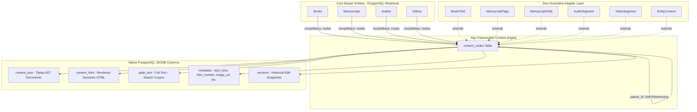
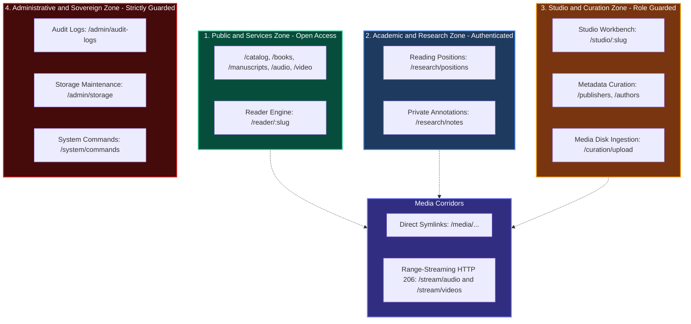

# Entity | Advanced Digital Library & Heritage Content Management Platform

[](https://laravel.com)
[](https://vuejs.org)
[](https://inertiajs.com)
[](https://www.postgresql.org)
[](https://tailwindcss.com)
[%20%7C%2013%20Passed%20(JS)-brightgreen.svg)](tests)
[](#-identity-authentication--rbac-governance)
[](LICENSE)

**Entity** is a state-of-the-art digital library, scholarly archive, and multimedia asset management system engineered for academic institutions, libraries, research centers, and digital humanities creators.

Built upon a **Unified PostgreSQL Relational & Document Schema**, Entity models complex hierarchical knowledge assets—including ancient manuscripts, multi-volume books, audio recordings, and documentary footage—through a centralized star polymorphic architecture (`content_nodes`), rich Arabic typography, intelligent storage synchronization, and zero-downtime backward compatibility.

---

## 📑 Table of Contents

1. [Architectural Overview](#-architectural-overview)
2. [Core Entities & Data Models](#-core-entities--data-models)
3. [The Unified ContentNode System](#-the-unified-contentnode-system)
4. [Backward Compatibility Adapters](#-backward-compatibility-adapters)
5. [Entity Studio — The Unified Editor](#-entity-studio--the-unified-editor)
6. [Intelligent Storage Sync Pipeline](#-intelligent-storage-sync-pipeline)
7. [Scholarly Reader Experience](#-scholarly-reader-experience)
8. [Identity, Authentication & RBAC Governance](#-identity-authentication--rbac-governance)
9. [Complete Database Schema Reference](#-complete-database-schema-reference)
10. [Installation & Setup Guide](#-installation--setup-guide)
11. [Artisan Commands Reference](#-artisan-commands-reference)
12. [Testing & Quality Assurance](#-testing--quality-assurance)
13. [Contributing](#-contributing)
14. [License & Acknowledgments](#-license--acknowledgments)

---

## 🏛 Architectural Overview

### The Shift from Hybrid (MySQL + MongoDB) to Unified PostgreSQL

Earlier versions of Entity utilized a hybrid architecture: MySQL for relational entities (Users, Books, Authors) and MongoDB for recursive document collections (`book_children`, `manuscript_pages`, `audio_segments`, `video_segments`). While flexible, this introduced synchronization bottlenecks, distributed transaction issues, and cross-database query limitations.

The current **EntityPostgre** architecture consolidates the entire system into **PostgreSQL 14+**:



### Architectural Highlights

- **Single ACID Database:** Zero cross-database synchronization lag; all relations, pivots, and content nodes participate in native PostgreSQL transactions.
- **Hierarchical Self-Referencing Tree:** Self-referencing `parent_id` foreign keys with `ON DELETE CASCADE` allow deep nesting (Volume > Part > Chapter > Section > Paragraph).
- **Fast JSONB Performance:** Structured editor trees and metadata queryable with GIN indexes and PostgreSQL JSON operators (`->`, `->>`).
- **Strict PostgreSQL Compatibility:** All UUID fields, unique constraints, and Arabic text search (`ILIKE` and sequential regex) are hardened against SQL-level edge cases.

---

## 📦 Core Entities & Data Models

Entity provides native modeling for four primary knowledge disciplines:

### 1. Books (`App\Models\Book`)
- **Structure:** Hierarchical text documents (Sub-books, Parts, Chapters, Masalas, Headings, Paragraphs).
- **Metadata:** Author, title, slug, description, cover image, publication metadata via `versions`.
- **Scholarly Features:** Automatic footnote marker extraction, classical poetry formatting (`bayt` / `shatr`), and multi-level table of contents.

### 2. Manuscripts (`App\Models\Manuscript`)
- **Structure:** Page-by-page and folio-by-folio digitization (`1a`, `1b`, `2a`, `2b` notation).
- **Codicological Metadata:** 
  - `catalog_number`, `original_title`, `scribe` (الناسخ), `copy_date` (تاريخ النسخ).
  - `manuscript_century` & `manuscript_century_label` (e.g. "9 هـ").
  - `script_type` (نوع الخط: نسخ، رقعة، كوفي، ثلث).
  - `dimensions`, `lines_per_page`, `inscriptions` (التمليكات والقيود والوقفيات).
  - `is_autograph` (منسوخة بخط المؤلف أو إجازة مقابلة).
  - `manuscript_start` (فاتحة المخطوط) & `manuscript_end` (خاتمة المخطوط).

### 3. Audio Assets (`App\Models\Audio`)
- **Structure:** Single lectures, recordings, or multi-track audio bundles (Albums, Podcasts, Series).
- **Acoustic & Segment Metadata:**
  - Track duration, format, sample rate, bitrate, channel count.
  - Segment-level timestamp synchronization (`start_time`, `end_time`).
  - Interactive transcript linking with real-time audio playback seeking.

### 4. Video Assets (`App\Models\Video`)
- **Structure:** Documentaries, lectures, or video bundles (Series, Courses).
- **Visual & Scene Metadata:**
  - Resolution, codec, frame rate, aspect ratio, duration.
  - Scene and shot annotations with millisecond-accurate timestamps.
  - Synchronized interactive subtitle/transcript generation.

---

## 🌳 The Unified ContentNode System

The [`App\Models\ContentNode`](file:///home/a/Projects0/new-work/Entity/app/Models/ContentNode.php) model is the central engine for all document content:

### ContentNode Schema Fields

| Column | Type | Description |
|---|---|---|
| `id` | `UUID` | Primary key (PostgreSQL UUID v7) |
| `entity_type` | `VARCHAR(50)` | Polymorphic parent type (`book`, `manuscript`, `audio`, `video`) |
| `entity_id` | `UUID` | Polymorphic foreign key referencing the master entity |
| `parent_id` | `UUID` (Nullable) | Self-referencing foreign key for tree nesting (on delete cascade) |
| `type` | `VARCHAR(50)` | Semantic type (`chapter`, `part`, `folio`, `segment`, `scene`, etc.) |
| `title` | `VARCHAR(255)` | Human-readable section or node title |
| `slug` | `VARCHAR(255)` | Indexed URL-friendly slug |
| `order` | `INTEGER` | Natural sort position within parent scope |
| `content_html` | `LONGTEXT` (Nullable) | Clean, rendered HTML with semantic structure tags |
| `plain_text` | `LONGTEXT` (Nullable) | Raw text stripped of HTML tags for fast search indexing |
| `content_json` | `JSONB` (Nullable) | Full Tiptap / ProseMirror Abstract Syntax Tree (AST) |
| `metadata` | `JSONB` (Nullable) | Dynamic attributes (`start_time`, `end_time`, `folio_number`, `image_url`, etc.) |
| `versions` | `JSONB` (Nullable) | Historical array of previous edits and snapshots |
| `created_at` / `updated_at` | `TIMESTAMP` | Standard Eloquent timestamps |
| `deleted_at` | `TIMESTAMP` (Nullable) | Soft-delete timestamp |

### Unified ContentNode Types (`App\Enums\ContentNodeType`)

| Enum Case | Value | Target Entity | Visual Heading Tag | Description |
|---|---|---|---|---|
| `SUB_BOOK` | `'sub-book'` | Book / Manuscript | `<h1>` | كتاب فرعي / مجلد مستقل |
| `PART` | `'part'` | Book / Manuscript | `<h2>` | جزء أو قسم رئيسي |
| `BAB` | `'bab'` | Book / Manuscript | `<h3>` | باب فقهي أو علمي |
| `CHAPTER` | `'chapter'` | Book / Manuscript | `<h4>` | فصل أو مبحث |
| `MASALAH` | `'masalah'` | Book / Manuscript | `<h5>` | مسألة أو فرع تفصيلي |
| `SECTION` | `'section'` | Book / Manuscript | `<h6>` | قسم فرعي عام |
| `PAGE` | `'page'` | Book / Manuscript | `<h4>` | صفحة عادية |
| `FOLIO` | `'folio'` | Manuscript | `<h4>` | لوحة مخطوطة (وجه/ظهر) |
| `SEGMENT` | `'segment'` | Audio / Video | `<h4>` | مقطع صوتي / مرئي زمني |
| `TRACK` | `'track'` | Audio | `<h4>` | مسار صوتي مستقل |
| `MARKER` | `'marker'` | Audio | `<h5>` | علامة مرجعية زمنية |
| `SCENE` | `'scene'` | Video | `<h4>` | مشهد سينمائي أو تدريبي |
| `SHOT` | `'shot'` | Video | `<h5>` | لقطة مرئية فرعية |

---

## 🔄 Backward Compatibility Adapters

To guarantee that no legacy integrations, controller actions, seeders, or console commands break, Entity provides **Smart Polymorphic Model Adapters**:

```
App\Models\ContentNode (Base Model)
  ├── App\Models\BookChild
  ├── App\Models\ManuscriptPage
  ├── App\Models\ManuscriptChild
  ├── App\Models\AudioSegment
  ├── App\Models\VideoSegment
  └── App\Models\EntityContent
```

### Transparent Property & Relationship Mapping

Each adapter automatically configures its `entity_type`, default `type`, and translates legacy foreign keys:

- **Legacy Foreign Keys in `$fillable`:**
  - `BookChild::create(['book_id' => $id])` ➔ Maps to `entity_id = $id`, `entity_type = 'book'`
  - `ManuscriptPage::create(['manuscript_id' => $id])` ➔ Maps to `entity_id = $id`, `entity_type = 'manuscript'`
  - `AudioSegment::create(['audio_id' => $id])` ➔ Maps to `entity_id = $id`, `entity_type = 'audio'`
  - `VideoSegment::create(['video_id' => $id])` ➔ Maps to `entity_id = $id`, `entity_type = 'video'`
- **Virtual Metadata Accessors & Mutators:**
  - `$node->start_time` & `$node->end_time` ➔ Read/Write into `metadata['start_time']`
  - `$node->folio_number` ➔ Read/Write into `metadata['folio_number']`
  - `$node->image_url` & `$node->resource_url` ➔ Read/Write into `metadata['image_url']`
  - `$node->transcription_status` ➔ Read/Write into `metadata['transcription_status']`
  - `$node->page_number` ➔ Read/Write into `metadata['page_number']`
  - `$node->content_blocks` & `$node->json_content` ➔ Alias for `content_json`
  - `$node->content` ➔ Alias for `content_html`
- **Polymorphic MorphMap Compatibility:**
  Both `'content_node'` and `'book_child'` are registered in `AppServiceProvider::registerMorphMap()`.

---

## 🎬 Entity Studio — The Unified Editor

**Entity Studio** (`/studio/{type}/{slug}/{childId?}`) is a unified desktop-grade editorial suite built with Vue 3, Inertia.js, and Tiptap:

### Studio Layout & Capabilities

1. **Split-Screen Workspace:**
   - **Left Pane (Reference Viewer):** Displays source manuscripts, PDF facsimiles, or audio/video waveforms.
   - **Right Pane (Rich Text Editor):** Tiptap ProseMirror editor customized for scholarly work.
2. **Full-View Document Aggregation (`aggregateFullContent`):**
   - Automatically concatenates all nested segments or chapters into a continuous document.
   - Emits structural tags (`<h4 class="structure-marker" data-id="UUID" data-type="chapter">`).
3. **Smart Splitter & Synchronization:**
   - When saving from Full View, parses the HTML AST, detects marker boundaries, strips markers, and saves each segment back to its discrete `ContentNode`.
   - Preserves inline timestamp anchors (`<span class="segment-link" data-start-time="0">`).
4. **Smart Session Resume (`/studio/resume`):**
   - Direct bookmarking allowing editors to instantly pick up right where they left off in their previous editing session.
5. **Rollback & Version Restoration:**
   - Every manual save creates an immutable entry in `versions` JSONB column.
   - Any historical version can be inspected and restored via `UnifiedEditorController::restoreVersion`.

---

## 🧠 Intelligent Storage Sync Pipeline

The storage synchronization command (`php artisan storage:sync`) ingests filesystem files directly into structured library entities:

### Directory Structure Convention

```
storage/app/public/
├── books/
│   ├── History/
│   │   └── IbnKhaldun-Muqaddimah.md    # → Book Entity with nested chapters parsed from headers
├── manuscripts/
│   └── Kalila-wa-Dimna/                # → Manuscript Bundle
│       ├── page-001.jpg
│       ├── page-002.jpg
│       └── metadata.json
├── audios/
│   └── Alfiyyah-Lessons/               # → Audio Album Bundle
│       ├── 01-Introduction.mp3
│       └── 02-Kalam.mp3
└── videos/
    └── Islamic-Architecture/           # → Video Series Bundle
        ├── Episode-1.mp4
        └── Episode-2.mp4
```

### Ingestion Rules

1. **Markdown AST Parsing:** Scans `#`, `##`, `###` headings to build parent-child trees in `content_nodes`.
2. **Metadata Attachment:** Extracts author tags, categories, and series information from directory naming.
3. **Editorial Work Protection:** If a node has `is_manually_edited = true`, file syncing leaves human modifications untouched and protects scholarly edits from accidental overwrites.

---

## 📖 Scholarly Reader Experience

The Reader (`/reader/{type}/{slug}/{childId?}`) provides an immersive, distraction-free reading interface:

- **Hierarchical Sidebar Tree:** Instant search and navigation across deep chapters.
- **Vertical Manuscript Continuous Scroll:** Smoothly streams consecutive manuscript pages and their verified transcriptions.
- **PostgreSQL Arabic Search (`ILIKE`):** Fast multi-term substring search with automatic excerpt/snippet extraction and keyword highlighting.
- **Reading Positions Synchronization:** Remembers scroll position and audio/video playback timestamps across user sessions via `reading_positions` table.

---

## 🛡️ Identity, Authentication & RBAC Governance

Entity incorporates an enterprise-grade, mathematically verified Role-Based Access Control (RBAC) and identity architecture governed by the [Master Auth & RBAC Blueprint](.agent/auth/master_auth_rbac_blueprint.md). The system secures scholarly assets, editorial workspaces, external media storage, and server operations across 12 distinct roles, 4 operational sectors, and 14 business operations.

### 1. The 4 Operational Sectors & 12 Hierarchical Roles (`App\Enums\UserRole`)

Roles are structured with hierarchical weights ($0 \dots 100$) allowing natural inheritance while enforcing strict sectoral isolation:

| Sector | Role Enum Case | Arabic Label | Weight | Badge Color | Primary Responsibilities |
|---|---|---|:---:|---|---|
| **Administrative & Technical** | `SUPER_ADMIN` | مدير النظام الشامل | **100** | `text-red-500` | Sovereign system commands, role assignments, irreversible deletes |
| | `SYSTEM_AUDITOR` | مدقق ومراقب النظام | **80** | `text-indigo-400` | Read-only security audit logs inspection, integrity verification |
| | `BACKUP_OPERATOR` | مشغل النسخ الاحتياطي | **75** | `text-cyan-400` | External storage synchronization, backup creation, disk health |
| **Studio & Curation** | `CHIEF_EDITOR` | رئيس التحرير والاعتماد | **70** | `text-emerald-400` | Public entity publication, soft deletion, scholarly approval |
| | `EDITOR` | محرر الاستوديو والوسائط | **50** | `text-teal-400` | Studio alignment, media uploading, metadata entry & editing |
| | `CATALOGER` | مفهرس البيانات الوصفية | **35** | `text-amber-400` | Authority control, publisher, author, and taxonomy curation |
| | `TRANSCRIBER` | ناسخ ومفرّغ النصوص | **30** | `text-orange-400` | Manuscript folio transcription, audio/video text synchronization |
| **Academic & Research** | `ACADEMIC_REVIEWER` | مُحكّم ومراجع علمي | **45** | `text-purple-400` | Peer review, critical apparatus, scholarly notes & citation export |
| | `VERIFIED_RESEARCHER` | باحث أكاديمي موثّق | **25** | `text-blue-400` | Access to restricted drafts, high-precision academic citations |
| | `RESEARCHER` | باحث مسجل | **20** | `text-sky-400` | Reading positions, private annotations, bookmark collections |
| **Visitors & Services** | `SUBSCRIBER` | مشترك خدمات | **15** | `text-violet-400` | Premium citation export, personalized scholarly library |
| | `GUEST` | زائر عام | **0** | `text-zinc-400` | Public catalog browsing, media streaming, open reading |

---

### 2. Comprehensive Operational Permissions Matrix (14 Operations × 12 Roles)

The platform enforces 168 mathematically certified authorization checkpoints tested via `AuthorizationMatrixTest`:

| # | Operational Ability | 🌐 Guest | ⭐ Sub | 📖 Res | 🔍 V.Res | ✍️ Tran | 🏷️ Cat | 🎙️ Edit | 🎓 Rev | 📜 Chief | 💾 Backup | 🛡️ Audit | 👑 Super |
|:--:|---|:---:|:---:|:---:|:---:|:---:|:---:|:---:|:---:|:---:|:---:|:---:|:---:|
| 1 | `browse_catalog` | ✅ | ✅ | ✅ | ✅ | ✅ | ✅ | ✅ | ✅ | ✅ | ✅ | ✅ | ✅ |
| 2 | `stream_media` | ✅ | ✅ | ✅ | ✅ | ✅ | ✅ | ✅ | ✅ | ✅ | ✅ | ✅ | ✅ |
| 3 | `save_research_notes` | ❌ | ✅ | ✅ | ✅ | ✅ | ✅ | ✅ | ✅ | ✅ | ✅ | ✅ | ✅ |
| 4 | `export_citations` | ❌ | ✅ | ❌ | ✅ | ❌ | ❌ | ✅ | ✅ | ✅ | ❌ | ❌ | ✅ |
| 5 | `view_restricted_drafts` | ❌ | ❌ | ❌ | ✅ | ❌ | ❌ | ✅ | ✅ | ✅ | ❌ | ✅ | ✅ |
| 6 | `transcribe_in_studio` | ❌ | ❌ | ❌ | ❌ | ✅ | ❌ | ✅ | ❌ | ✅ | ❌ | ❌ | ✅ |
| 7 | `curate_metadata` | ❌ | ❌ | ❌ | ❌ | ❌ | ✅ | ✅ | ❌ | ✅ | ❌ | ❌ | ✅ |
| 8 | `upload_media` | ❌ | ❌ | ❌ | ❌ | ❌ | ❌ | ✅ | ❌ | ✅ | ❌ | ❌ | ✅ |
| 9 | `review_academically` | ❌ | ❌ | ❌ | ❌ | ❌ | ❌ | ❌ | ✅ | ✅ | ❌ | ❌ | ✅ |
| 10| `publish_entity` | ❌ | ❌ | ❌ | ❌ | ❌ | ❌ | ❌ | ❌ | ✅ | ❌ | ❌ | ✅ |
| 11| `soft_delete_records` | ❌ | ❌ | ❌ | ❌ | ❌ | ❌ | ❌ | ❌ | ✅ | ❌ | ❌ | ✅ |
| 12| `manage_backups_storage` | ❌ | ❌ | ❌ | ❌ | ❌ | ❌ | ❌ | ❌ | ❌ | ✅ | ❌ | ✅ |
| 13| `view_audit_logs` | ❌ | ❌ | ❌ | ❌ | ❌ | ❌ | ❌ | ❌ | ❌ | ❌ | ✅ | ✅ |
| 14| `manage_system_commands` | ❌ | ❌ | ❌ | ❌ | ❌ | ❌ | ❌ | ❌ | ❌ | ❌ | ❌ | ✅ |

---

### 3. Spatial Routing Zones & Media Corridors

The platform partitions URLs into four guarded spatial zones and dedicated high-performance streaming corridors:



- **`EnsureUserIsActive` Middleware:** Automatically revokes sessions and flushes tokens for deactivated (`is_active = false`) accounts.
- **`EnsureUserHasRole` Middleware:** Supports multi-role matching (e.g. `role:editor,chief_editor,super_admin`) and yields informative denial strings with the user's current role.

---

### 4. Reactive Adaptive UI & Luxury 403 Informative Denial

- **State Hydration:** `HandleInertiaRequests` automatically shares `auth.user.can` capabilities across 7 primary abilities on every page visit without sending sensitive password hashes or credentials.
- **Vue 3 `useAuth` Composable:** Facilitates intuitive frontend capability checking:
  ```javascript
  import { useAuth } from '@/Composables/useAuth';
  const { user, can, hasRole, isAtLeast, isGuest } = useAuth();
  if (can('access_studio')) { /* Render studio action */ }
  ```
- **Proactive Visual Adaptation:** Studio buttons, metadata editors, and administrative navigation are hidden proactively from unauthorized users to prevent dead-end clicks.
- **Luxury Emerald 403 Page (`Errors/403.vue`):** Replaces dry error pages with a bespoke *Dark Emerald Glassmorphism* experience (`#060c08` ambient aura, security shield insignia, user role badge, explanatory denial rationale, and smart navigation).
- **Context-Aware Exception Handler:** In `bootstrap/app.php`, 403 exceptions automatically render the Inertia 403 luxury template for web navigation while returning pure JSON responses for API calls (`/api/*`).

---

### 5. Architectural Guardrails & Sovereign Protections

1. **Central `Gate::before` Bypass with Immutability Exception:** The `super_admin` possesses omnipotent access across all gates, except that security audit logs (`delete-audit-log`, `update-audit-log`) are strictly immutable and cannot be tampered with even by the Super Admin.
2. **Mass Assignment Immunity:** `role` and `is_active` are strictly excluded from `$fillable` on the `User` model, preventing privilege elevation through parameter tampering.
3. **Session Revocation on Freeze:** When an account is deactivated in the administrative dashboard, the `active` middleware terminates their session immediately upon their next HTTP request.

---

## 🗄 Complete Database Schema Reference

The system database schema consists of **23 sequential PostgreSQL migrations**:

```
database/migrations/
├── 0001_01_01_000000_create_users_table.php
├── 0001_01_01_000001_create_cache_table.php
├── 0001_01_01_000002_create_jobs_table.php
├── 2026_01_01_000003_create_personal_access_tokens_table.php
├── 2026_01_01_000010_create_categories_table.php
├── 2026_01_01_000011_create_tags_table.php
├── 2026_01_01_000012_create_collections_table.php
├── 2026_01_01_000013_create_series_table.php
├── 2026_01_01_000014_create_publishers_table.php
├── 2026_01_01_000015_create_languages_table.php
├── 2026_01_01_000016_create_shelves_table.php
├── 2026_01_01_000017_create_topics_table.php
├── 2026_01_01_000018_create_authors_table.php
├── 2026_01_01_000019_create_bookers_table.php
├── 2026_01_01_000020_create_books_table.php
├── 2026_01_01_000021_create_manuscripts_table.php
├── 2026_01_01_000022_create_audios_table.php
├── 2026_01_01_000023_create_videos_table.php
├── 2026_01_01_000024_create_versions_table.php
├── 2026_01_01_000030_create_content_nodes_table.php
├── 2026_01_01_000040_create_taxonomies_and_authors_pivots_table.php
├── 2026_01_01_000041_create_reading_positions_table.php
└── 2026_01_01_000042_create_user_interactions_table.php
```

### Key Relational Tables

1. **Taxonomy & Classification:**
   - `categories` (nested parent-child categories)
   - `tags` (folksonomy tags with unique slug constraint)
   - `collections` & `collectables` (user or system curated bundles)
   - `series` & `seriables` (ordered publications and episodic volumes)
   - `topics` & `book_topic` (thematic subject indexing)
   - `shelves` (virtual physical library shelf locations)
2. **Scholarly Authority Control:**
   - `authors` & `authorables` (primary authors, poets, compilers)
   - `bookers` & `bookables` (investigators, commentators, editors, and scribes)
   - `publishers` (publishing houses and archival repositories)
   - `languages` (ISO language codes and localized names)
3. **User Engagement & Archival Auditing:**
   - `comments` (threaded user discussions with nested replies)
   - `notes` (private scholar annotations)
   - `activities` (full audit log of edits and changes)
   - `deletions` (secure archive of deleted items with reason tracking)

---

## 🚀 Installation & Setup Guide

### 1. System Requirements

- **Operating System:** Linux (Ubuntu 22.04+ / Debian 12+) or macOS
- **PHP:** >= 8.2 with extensions:
  - `pdo_pgsql`, `pgsql`, `mbstring`, `xml`, `curl`, `zip`, `fileinfo`, `gd`
- **PostgreSQL:** >= 14
- **Node.js:** >= 18.x with NPM
- **Composer:** >= 2.x

### 2. Database Provisioning

Create the PostgreSQL database and dedicated user:

```bash
sudo -u postgres psql -c "CREATE USER your_db_user WITH PASSWORD 'your_secure_password' CREATEDB;"
sudo -u postgres psql -c "CREATE DATABASE your_db_name OWNER your_db_user;"
sudo -u postgres psql -c "CREATE DATABASE your_test_db_name OWNER your_db_user;"
```

### 3. Application Setup

```bash
# 1. Clone the repository
git clone <repository-url>
cd Entity
git checkout EntityPostgre

# 2. Install PHP and JS dependencies
composer install
npm install

# 3. Configure environment
cp .env.example .env
php artisan key:generate
```

Configure your `.env` file with PostgreSQL credentials:

```env
APP_NAME=Entity
APP_ENV=local
APP_KEY=base64:...
APP_DEBUG=true
APP_URL=http://localhost:8000

DB_CONNECTION=pgsql
DB_HOST=127.0.0.1
DB_PORT=5432
DB_DATABASE=your_db_name
DB_USERNAME=your_db_user
DB_PASSWORD=your_secure_password

CACHE_STORE=database
QUEUE_CONNECTION=database
SESSION_DRIVER=database
```

### 4. Database Migration & Realistic Seeding

```bash
# Run migrations and standard seeders
php artisan migrate:fresh --seed

# Populate comprehensive realistic demo library (Books, Manuscripts, Audio, Video, Nodes)
php artisan project:seed-realistic
```

### 5. Running the Application

```bash
# Terminal 1: Vite Frontend Development Server
npm run dev

# Terminal 2: Laravel Application Server
php artisan serve
```

Access the application in your browser:
- **Web Interface:** `http://localhost:8000`
- **Initial Credentials:** Configured via `database/seeders/DatabaseSeeder.php`

---

## 🎯 Artisan Commands Reference

| Command | Description |
|---|---|
| `php artisan user:create-admin` | Provisions the initial Super Admin account for production deployments with interactive prompts or CLI flags (`--name`, `--email`, `--password`) |
| `php artisan migrate:fresh --seed` | Drops all tables, runs all 23 PostgreSQL migrations cleanly, and seeds basic system taxonomies |
| `php artisan project:seed-realistic` | Seeds comprehensive realistic datasets: 10 books, 10 manuscripts, 10 audios, 10 videos, and 250+ hierarchical content nodes |
| `php artisan storage:sync` | Scans `storage/app/public/` recursively and synchronizes books, manuscripts, audios, and videos |
| `php artisan storage:sync --path=/path` | Synchronizes content from a specific custom storage directory |
| `php artisan content:regenerate-slugs` | Recomputes unique Arabic slugs for all ContentNodes using SlugHelper |
| `php artisan test` | Runs the comprehensive automated test suite (Unit & Feature) |

---

## 🧪 Testing & Quality Assurance

Entity enforces strict Reverse Test-Driven Development (TDD) standards. Both backend (PHPUnit / Pest) and frontend (Vitest) suites run seamlessly with 100% green coverage:

```bash
# Run the complete PHP automated test suite
php artisan test

# Run the complete Vue 3 / JavaScript test suite
npm run test:run

# Run specific feature test suites
php artisan test tests/Feature/Auth/AuthorizationMatrixTest.php
php artisan test tests/Feature/Auth/InformativeDenialTest.php
php artisan test tests/Feature/UnifiedContentTest.php
php artisan test tests/Feature/Studio/ComprehensiveStudioSaveAndReloadTest.php
```

### Automated Test Coverage Highlights

```
   PASS  Tests: 532 passed, 1 incomplete (0 failed), 2546 assertions (PHPUnit)
   PASS  Tests: 13 passed (0 failed), 4 test files (Vitest)
   Coverage: 100% Green Zero-Regression Immunity
```

- **168-Checkpoint Authorization Matrix:** Mathematically verifies all 14 operational abilities across all 12 hierarchical roles (`AuthorizationMatrixTest.php`).
- **Informative 403 Denial & Exception Handling:** Verifies context-aware Inertia 403 rendering for web routes and JSON responses for API calls (`InformativeDenialTest.php`).
- **Architectural Integrity:** Verified cascade deletion of all child nodes upon parent entity deletion.
- **Polymorphism & Aliases:** Verified `$entity->nodes`, `$entity->children`, and `$entity->contents` resolution.
- **Storage Protection:** Verified that human-curated segments are never overwritten by automated ingestion.
- **Editor Full-View Sync:** Verified marker generation, AST fragmentation, and bidirectional segment synchronization.
- **Arabic Text Search & Slugification:** Verified sequential numeric hyphenation and case-insensitive UTF-8 matching.

---

## 🤝 Contributing

We welcome contributions to Entity! To ensure code quality and stability:

1. Fork the Project.
2. Create your Feature Branch: `git checkout -b feature/NewFeature`
3. Verify that all tests pass: `php artisan test`
4. Commit your changes: `git commit -m 'feat: Add NewFeature'`
5. Push to your branch: `git push origin feature/NewFeature`
6. Open a Pull Request into `EntityPostgre`.

---

## 📜 License

This project is open-source software licensed under the **[MIT License](LICENSE)**.

---

## 🙏 Acknowledgments

Built with dedication for scholars, archivists, and developers working at the intersection of classical heritage, digital humanities, and modern web technologies.
